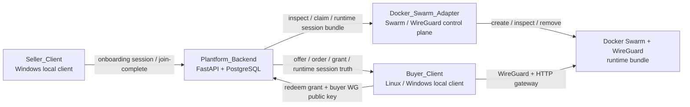
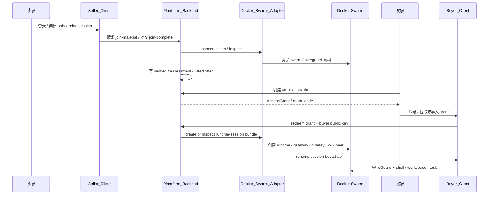

# Pivot Network

> A seller-to-buyer compute marketplace prototype with verified seller onboarding, offer commercialization, buyer runtime sessions, WireGuard access, browser shell, workspace sync, and task execution.

更新时间：`2026-04-12`

## 项目简介

`Pivot Network` 解决的是“卖家提供算力，买家像使用云主机一样消费它”的问题。

这个项目当前已经不是概念验证草图，而是已经在真实链路上验证过下面这条主线：

```text
Seller_Client
  -> verified seller node
  -> listed offer
  -> order
  -> access grant
  -> runtime session
  -> WireGuard
  -> shell / workspace / task
```

当前已验证：

- 卖家本地接入主线
- 后端商品化主线
- 买家本地客户端主线
- Windows 本地 buyer 真链路
- 一轮真实扰动稳定性测试

## 先理解一句关键话

买家**不是直接 SSH 到卖家宿主机**。

真正发生的是：

1. 卖家把节点接入平台
2. 后端把节点商品化成 `Offer`
3. 买家下单后拿到 `AccessGrant`
4. 平台为买家创建或恢复 `RuntimeSession`
5. 买家通过本地 `Buyer_Client` 拉起 `WireGuard`
6. 买家在浏览器里进入这个 `RuntimeSession` 的 shell

所以从体验上看像“远程登录一台机器”，但系统语义上，买家操作的是平台编排出的会话实例，而不是卖家宿主机本体。

## 架构图



## 端到端时序图



## 仓库结构

```text
.
├── Plantform_Backend/            # FastAPI + PostgreSQL 业务真相面
├── Docker_Swarm/                 # Swarm / WireGuard / runtime adapter
├── Seller_Client/                # 卖家本地客户端
├── Buyer_Client/                 # 买家本地客户端
├── docs/tutorials/               # 新手教程与带标注截图
├── docs/runbooks/                # 当前项目状态总览与少量协作入口
└── 项目名词说明.md                # 面向不了解底层同学的扫盲文档
```

## 当前能力边界

### Seller 侧

- 本地 Web 客户端
- seller 登录 / 注册
- onboarding session
- MCP / AI 助手驱动接入
- manager task-based acceptance
- backend 自动商品化成真实 offer

### Buyer 侧

- 本地 Web / Local API
- active grant 拉取与 attach
- grant code 导入
- same-session `RuntimeSession` create / refresh
- `WireGuard` up / down
- shell 打开
- workspace sync / status
- task submit / logs readback
- Web 自然语言入口驱动 Buyer_Client + MCP

## 快速部署

这里给的是**开发者快速启动路径**，用于让 GitHub 访客在本地把主要组件跑起来。

完整 seller -> buyer 真链路还依赖一套已配置好的：

- Docker Swarm manager / worker
- Docker_Swarm_Adapter
- WireGuard 网络
- 可访问的 backend / gateway 地址

也就是说：

- 下面的步骤适合快速启动仓库里的主要服务和客户端
- 如果你要完全复现真实交易链路，需要继续按仓库文档配置 Swarm + Adapter + WireGuard

### 1. 启动后端

要求：

- Linux
- Docker + Docker Compose Plugin

命令：

```bash
cd Plantform_Backend
cp .env.example .env
docker compose up -d --build
```

默认会启动：

- PostgreSQL 16：`localhost:55432`
- FastAPI：`localhost:8000`

当前 compose 使用：

- `Plantform_Backend/compose.yml`
- `Plantform_Backend/.env.example`

### 2. 启动卖家客户端

当前 seller 推荐入口是 Windows 本地客户端。

命令：

```powershell
cd Seller_Client
powershell -ExecutionPolicy Bypass -File ".\bootstrap\windows\install_and_check_seller_client.ps1"
powershell -ExecutionPolicy Bypass -File ".\bootstrap\windows\start_seller_client.ps1"
```

默认本地页面：

- `http://127.0.0.1:8901/`

### 3. 启动买家客户端

#### Linux

```bash
cd Buyer_Client
python -m venv .venv
source .venv/bin/activate
pip install -e .
python -m uvicorn buyer_client_app.main:app --host 127.0.0.1 --port 8902
```

#### Windows

```powershell
cd Buyer_Client
powershell -ExecutionPolicy Bypass -File ".\bootstrap\windows\start_buyer_client.ps1"
```

默认本地页面：

- `http://127.0.0.1:8902/`

### 4. 启动 Adapter

如果你要继续复现完整 runtime / WireGuard / session bundle 行为，还需要启动 `Docker_Swarm_Adapter`：

```bash
cd Docker_Swarm/Docker_Swarm_Adapter
./scripts/install-venv.sh
./scripts/check.sh
./scripts/run-dev.sh
```

默认端口：

- `8010`

## 最小成功标准

### Seller 成功

不是看本地 `docker info`，而是看：

- manager 侧 worker `Ready`
- manager 侧该 worker 上有真实 swarm task 可运行或已运行

### Buyer 成功

至少要同时看到：

- `runtime_session.status = ready`
- `runtime_bundle_status = running`
- `wireguard_up` 成功
- `/health` 可读
- shell 可打开
- `workspace/status = 200`
- task `exit_code = 0`

## 文档入口

如果你是第一次看这个仓库，推荐顺序：

1. [PROJECT.md](./PROJECT.md)
2. [项目名词说明.md](./项目名词说明.md)
3. [卖家 / 买家端到端教程](./docs/tutorials/seller-buyer-e2e-guide-cn.md)
4. [Seller_Client/README.md](./Seller_Client/README.md)
5. [Buyer_Client/README.md](./Buyer_Client/README.md)
6. [Plantform_Backend/README.md](./Plantform_Backend/README.md)
7. [Docker_Swarm/Docker_Swarm_Adapter/README.md](./Docker_Swarm/Docker_Swarm_Adapter/README.md)

## 当前项目状态

当前没有预定义的 `Stage8`。

当前 repo 的主要工作已经从“主功能是否存在”转向：

- 文档整理
- 新手教程
- 历史状态文档归档
- 新 scope 定义
