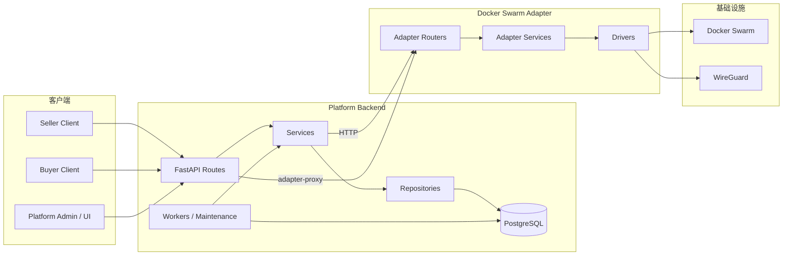
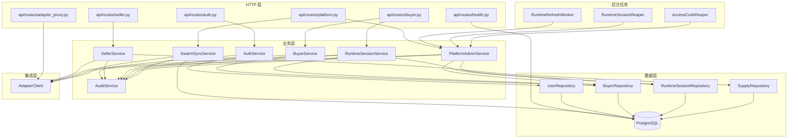
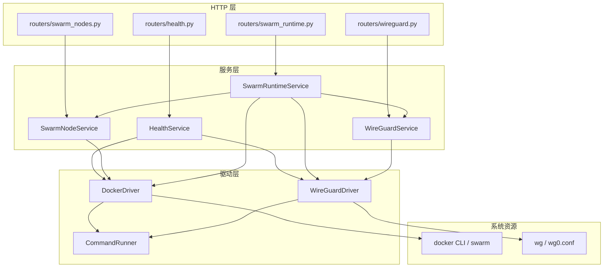
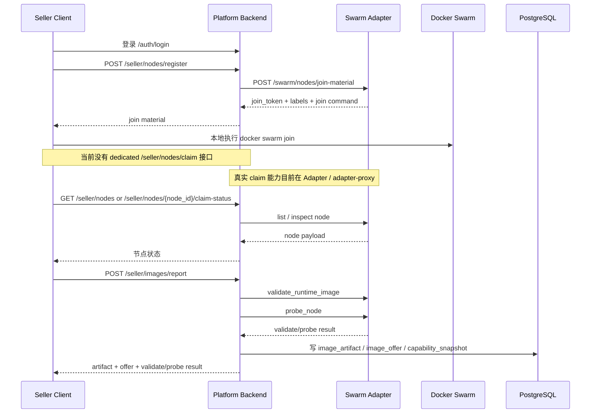
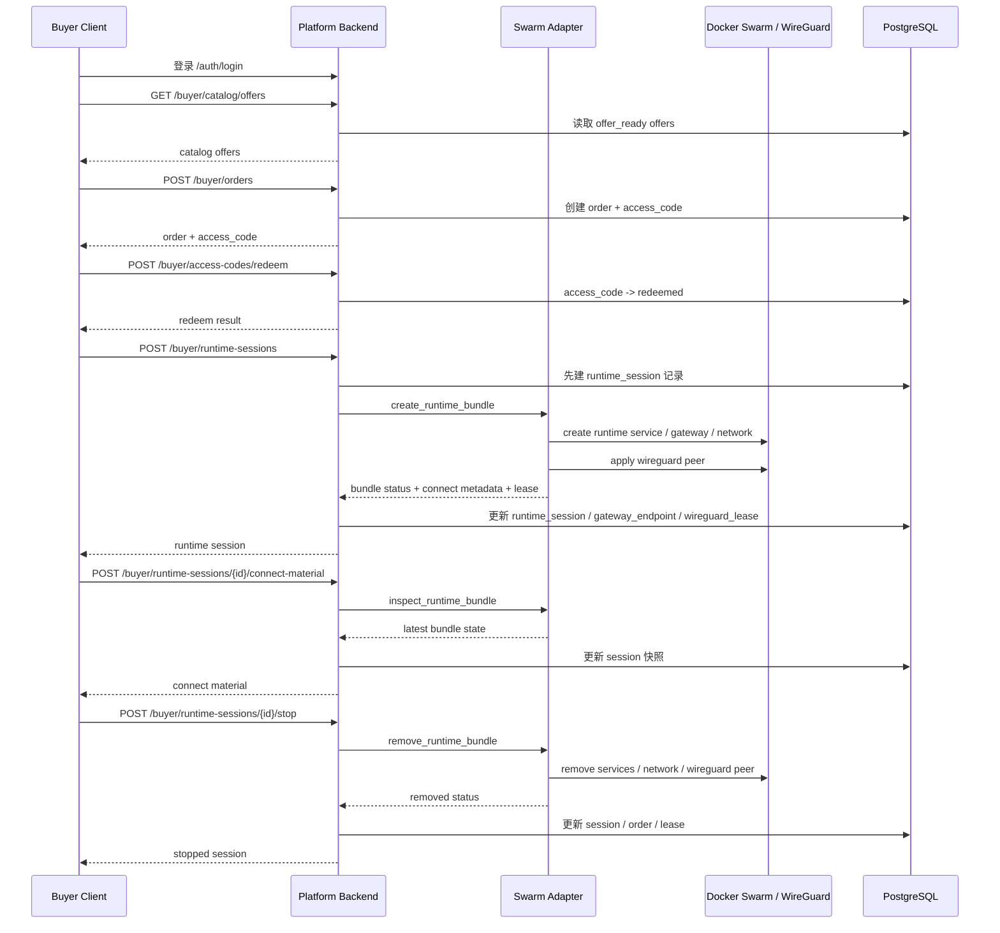
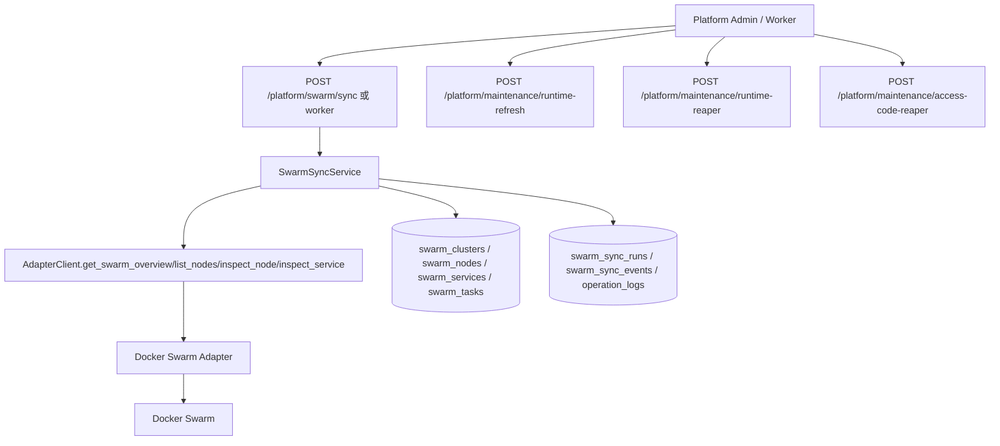
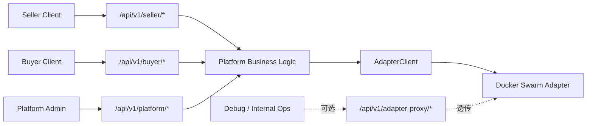

# 当前后端 / Adapter / Client 接口与责任边界说明

更新时间：`2026-04-06`

## 1. 文档目的

这份文档只描述“当前代码里已经实际存在的实现”，不描述理想方案。

重点回答 4 个问题：

1. `Backend/` 现在实际负责什么
2. `Docker_Swarm/Docker_Swarm_Adapter/` 现在实际负责什么
3. 各模块的责任、能力边界和调用关系是什么
4. `seller client`、`buyer client` 当前应该走哪些接口

---

## 2. 总体拓扑

---

## 3. 一句话分工

- `Platform Backend`
  负责用户、角色、订单、access code、runtime session、平台数据库、审计、同步读模型、客户端工作流接口。
- `Docker Swarm Adapter`
  负责真实的 Docker Swarm / WireGuard 读写动作。
- `Seller Client`
  负责卖家本地控制台工作流：登录、获取 bootstrap、Windows host 检查、同步 build context 到 WSL Ubuntu、引导 Ubuntu compute 执行 `docker swarm join`、claim 节点、上报镜像。
- `Buyer Client`
  负责买家侧操作，例如登录、浏览 offer、下单、兑换 access code、获取 connect material、建立本地连接。

补充说明：

- 当前仓库里仍存在少量 seller 本地兼容代码，但 seller 官方交付路径已经固定为 `Windows 控制台 + WSL Ubuntu compute`
- Windows 不再是 seller 正式 compute node

核心原则：

- Client 默认只连 `Backend`
- `Backend` 默认只通过 HTTP 调 `Adapter`
- `Adapter` 才能直接操作 `Docker Swarm` 和 `WireGuard`

---

## 4. 当前实际模块拆分

## 4.1 Platform Backend 模块图

## 4.2 Adapter 模块图

---

## 5. 各模块责任与能力边界

## 5.1 Platform Backend 的责任

### 负责什么

- 用户注册、登录、token 鉴权
- `buyer / seller / platform_admin` 角色区分
- 平台业务状态
  - 用户
  - seller profile / buyer profile
  - image artifact / offer
  - order / access code
  - runtime session
  - gateway endpoint / wireguard lease 快照
- Swarm 同步后的平台读模型
  - cluster
  - node
  - service
  - task
  - sync run / sync event
- 平台审计与 operation log
- 平台维护 worker
- 面向 client 的工作流 API

### 不负责什么

- 不直接执行 `docker` 命令
- 不直接操作 `wg`
- 不直接读写 `/etc/wireguard/wg0.conf`
- 不直接 SSH 到 manager
- 不直接创建 Swarm service / overlay network

### 当前真实边界

- `Backend` 是业务编排层
- 它可以决定“什么时候创建 session”
- 但不能自己完成“如何在 Swarm 上创建 runtime/gateway”

---

## 5.2 Adapter 的责任

### 负责什么

- 读取 Swarm 总览
- 读取节点列表 / 节点详情 / 节点任务
- 生成 join material
- claim node
- 修改 node availability
- remove node
- validate runtime image
- probe node
- inspect service
- create / inspect / remove runtime bundle
- apply / remove wireguard peer

### 不负责什么

- 不负责登录注册
- 不负责订单
- 不负责 access code
- 不负责平台数据库写入
- 不负责 platform audit log
- 不应该直接暴露给 seller client / buyer client 作为正式入口

### 当前真实边界

- `Adapter` 是基础设施动作执行层
- 它知道“怎么做”
- 但不知道“这个动作在平台业务上是否合法”

---

## 5.3 Seller Client 的责任

### 负责什么

- 登录平台
- 获取节点加入材料
- 在卖家本地执行 `docker swarm join`
- 查询自己名下节点
- 查询 runtime contract / base image
- 上报镜像
- 查询自己的 images / offers

### 不负责什么

- 不应直连 Adapter
- 不应直接改 WireGuard 服务端
- 不应直接创建 runtime bundle
- 不应直接操作平台数据库

### 当前代码里的一个重要事实

当前 `seller` 工作流接口没有单独暴露 `claim node` API。

这意味着当前 seller onboarding 的“正式工作流”里，存在一个缺口：

- `POST /api/v1/seller/nodes/register` 只能拿到 join material
- 节点真正的 `claim` 动作目前只在 Adapter / `adapter-proxy` 层存在

所以从“产品化工作流”角度看，卖家接入还没有完全封装完。

---

## 5.4 Buyer Client 的责任

### 负责什么

- 登录平台
- 浏览可售 offers
- 创建订单
- 兑换 access code
- 创建 runtime session
- 获取 connect material
- 停止 runtime session

### 不负责什么

- 不应直连 Adapter
- 不应自己创建 Swarm service
- 不应直接改 WireGuard 服务端
- 不应直接操作 order / access code / session 的数据库状态

---

## 6. 当前实际工作流

## 6.1 Seller 工作流

### Seller 工作流说明

- `seller` 正式工作流 API 已经覆盖“取加入材料、查节点、上报镜像、查 images/offers”
- 但“claim node”这一步还没有封进 `seller` 路由
- `images/report` 会联动 Adapter 做校验和探测，然后把结果落到平台数据库

---

## 6.2 Buyer 工作流

### Buyer 工作流说明

- 当前 buyer 主线是完整的
- `access code` 必须先 `redeem`，之后才能创建 runtime session
- runtime session 的真实基础设施动作全部由 Adapter 完成
- `Backend` 负责把 Adapter 返回结果写回数据库

---

## 6.3 平台同步与维护工作流

### 说明

- `swarm sync` 的目标是把基础设施状态同步成平台数据库读模型
- runtime refresh / reaper / access-code reaper 既可由 API 手动触发，也可由内建 worker 执行
- 默认配置下内建 worker 不自动启动

---

## 7. 当前给 Seller Client 的接口

说明：

- 以下是当前代码里适合 `seller client` 使用的接口
- 除登录注册外，默认都需要 Bearer Token
- 角色要求一般为 `seller` 或 `platform_admin`

## 7.1 通用认证接口

| 方法 | 路径 | 作用 | 备注 |
|---|---|---|---|
| `POST` | `/api/v1/auth/register` | 注册账号 | 当前代码允许注册 `seller` / `buyer` / `platform_admin` |
| `POST` | `/api/v1/auth/login` | 登录 | 返回 access token |
| `POST` | `/api/v1/auth/logout` | 登出 | 需要 bearer token |
| `GET` | `/api/v1/auth/me` | 获取当前用户 | 用于 client 启动后自检 |

## 7.2 Seller 工作流接口

| 方法 | 路径 | 作用 | 当前实际能力 |
|---|---|---|---|
| `GET` | `/api/v1/seller/runtime-base-images` | 查询平台基础镜像 | 返回当前配置里的 managed base image |
| `GET` | `/api/v1/seller/runtime-contract` | 查询 runtime 契约 | 返回 contract version、shell agent path、requirements |
| `POST` | `/api/v1/seller/nodes/register` | 获取节点接入材料 | 实际上调用 Adapter `join-material` |
| `GET` | `/api/v1/seller/nodes` | 查询 seller 自己的节点 | 实际依赖 Adapter `list_nodes` |
| `GET` | `/api/v1/seller/nodes/{node_id}` | 查询单节点详情 | 实际依赖 Adapter `inspect_node` |
| `GET` | `/api/v1/seller/nodes/{node_id}/claim-status` | 查询 claim 状态 | 读取节点 labels 计算是否 claimed |
| `POST` | `/api/v1/seller/images/report` | 上报 runtime image | 会触发 validate + probe，并写数据库 |
| `GET` | `/api/v1/seller/images` | 查询 seller image artifacts | 从平台数据库读取 |
| `GET` | `/api/v1/seller/offers` | 查询 seller offers | 从平台数据库读取 |

## 7.3 Seller 目前缺失的正式接口

当前 `seller client` 如果要完整走“加入集群 -> claim 节点 -> 上报镜像”的正式工作流，还缺一个后端 seller 路由：

- 建议未来补：`POST /api/v1/seller/nodes/{node_id}/claim`

因为当前真实存在的 claim 能力在：

- Adapter: `POST /swarm/nodes/claim`
- Backend passthrough: `POST /api/v1/adapter-proxy/swarm/nodes/claim`

这意味着它现在是“能力存在，但没有封进 seller 产品接口”。

---

## 8. 当前给 Buyer Client 的接口

说明：

- 以下是当前代码里适合 `buyer client` 使用的接口
- 除登录注册外，默认需要 Bearer Token
- 角色要求一般为 `buyer` 或 `platform_admin`

## 8.1 通用认证接口

| 方法 | 路径 | 作用 | 备注 |
|---|---|---|---|
| `POST` | `/api/v1/auth/register` | 注册账号 | 当前代码允许注册 `buyer` |
| `POST` | `/api/v1/auth/login` | 登录 | 返回 access token |
| `POST` | `/api/v1/auth/logout` | 登出 | 撤销 token |
| `GET` | `/api/v1/auth/me` | 获取当前用户 | 校验会话 |

## 8.2 Buyer 工作流接口

| 方法 | 路径 | 作用 | 当前实际能力 |
|---|---|---|---|
| `GET` | `/api/v1/buyer/catalog/offers` | 浏览可售 offer | 只返回 `offer_ready` |
| `POST` | `/api/v1/buyer/orders` | 创建订单 | 同时签发 access code |
| `GET` | `/api/v1/buyer/orders/{order_id}` | 查询订单 | 只允许看自己的订单 |
| `POST` | `/api/v1/buyer/access-codes/redeem` | 兑换 access code | 把状态改为 `redeemed` |
| `POST` | `/api/v1/buyer/runtime-sessions` | 创建 runtime session | 会调用 Adapter 创建 bundle |
| `GET` | `/api/v1/buyer/runtime-sessions/{session_id}` | 查询 session | 读取平台数据库 |
| `POST` | `/api/v1/buyer/runtime-sessions/{session_id}/connect-material` | 获取最新 connect material | 会调用 Adapter inspect bundle |
| `POST` | `/api/v1/buyer/runtime-sessions/{session_id}/stop` | 停止 session | 会调用 Adapter remove bundle |

## 8.3 Buyer 创建 session 时需要的关键字段

当前 `POST /api/v1/buyer/runtime-sessions` 需要：

- `access_code`
- `network_mode`
- `wireguard_public_key`

也就是说当前 buyer session 默认已经把 WireGuard 接入材料纳入主流程。

---

## 9. 当前不建议 Client 直接使用的接口

## 9.1 Backend `adapter-proxy`

当前后端暴露了：

- `/api/v1/adapter-proxy/swarm/...`
- `/api/v1/adapter-proxy/wireguard/...`

这些接口的作用更偏向：

- 平台调试
- 平台内部运维
- 在 seller/buyer 工作流 API 还不完善时，临时透传 Adapter 能力

不建议把它作为 `seller client` / `buyer client` 的长期正式入口。

原因：

- 它直接暴露基础设施原子能力
- 不等于稳定的产品工作流接口
- 容易把 client 和基础设施细节耦合在一起

## 9.2 Adapter 自身接口

当前 Adapter 有完整接口，但它的定位是：

- 供 `Backend` 调用
- 供受控环境内的平台运维调试

不建议 seller / buyer client 直接调用：

- `/swarm/overview`
- `/swarm/nodes`
- `/swarm/nodes/claim`
- `/swarm/runtime-session-bundles/create`
- `/wireguard/peers/apply`

因为这样会绕开平台业务层。

---

## 10. 当前接口分层建议

建议理解为：

- `seller client` 走 `seller/*`
- `buyer client` 走 `buyer/*`
- `platform admin` 走 `platform/*`
- `adapter-proxy/*` 是内部过渡层，不是最佳正式入口

---

## 11. 当前系统的边界总结

## 11.1 Backend 的边界总结

Backend 现在已经能做：

- 平台业务状态管理
- 认证鉴权
- offer / order / access code / runtime session 主流程
- Swarm 同步
- 运维维护 worker

Backend 现在还没完全封装好的点：

- seller 节点 claim 工作流还没在 `seller/*` 下产品化
- 部分 `adapter-proxy` 仍然暴露了底层基础设施能力

## 11.2 Adapter 的边界总结

Adapter 现在已经能做：

- 真实读取 Swarm
- 真实读写 node labels / availability
- 真实创建和删除 runtime bundle
- 真实管理 WireGuard peer

Adapter 不应该承担：

- 用户系统
- 订单系统
- access code 生命周期
- 平台数据库读写

## 11.3 Client 的边界总结

Seller / Buyer Client 当前最合理的边界是：

- 做本地交互和本地动作
- 通过 Backend 获取工作流结果
- 不把自己写成直接操作基础设施的控制面

---

## 12. 当前状态下的推荐使用方式

### Seller Client

推荐只依赖：

- `auth/*`
- `seller/runtime-base-images`
- `seller/runtime-contract`
- `seller/nodes/register`
- `seller/nodes`
- `seller/nodes/{node_id}`
- `seller/nodes/{node_id}/claim-status`
- `seller/images/report`
- `seller/images`
- `seller/offers`

必要时的临时补充：

- 如果必须做 node claim，而后端还没补 seller claim 接口，短期只能由平台侧或 `adapter-proxy` 代办

### Buyer Client

推荐只依赖：

- `auth/*`
- `buyer/catalog/offers`
- `buyer/orders`
- `buyer/orders/{order_id}`
- `buyer/access-codes/redeem`
- `buyer/runtime-sessions`
- `buyer/runtime-sessions/{id}`
- `buyer/runtime-sessions/{id}/connect-material`
- `buyer/runtime-sessions/{id}/stop`

---

## 13. 结论

当前系统已经形成了清晰的三层结构：

1. `Client`
2. `Platform Backend`
3. `Docker Swarm Adapter`

其中：

- `Backend` 是业务控制层
- `Adapter` 是基础设施执行层
- `seller client` / `buyer client` 是工作流消费方

从“实际落地程度”看：

- `buyer` 主线已经比较完整
- `seller` 主线已覆盖大部分能力，但 `claim node` 还没有完全封装进正式 seller API
- `platform` 和 `adapter-proxy` 当前还承担了一部分过渡性职责

如果后续要继续收敛架构，最优先的一步是：

> 把 seller onboarding 的 `claim node` 正式补进 `seller/*`，让 client 不再需要依赖 `adapter-proxy` 或平台侧代办。
