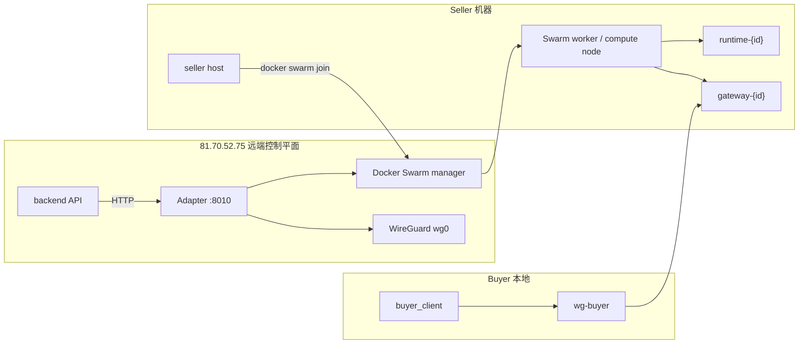
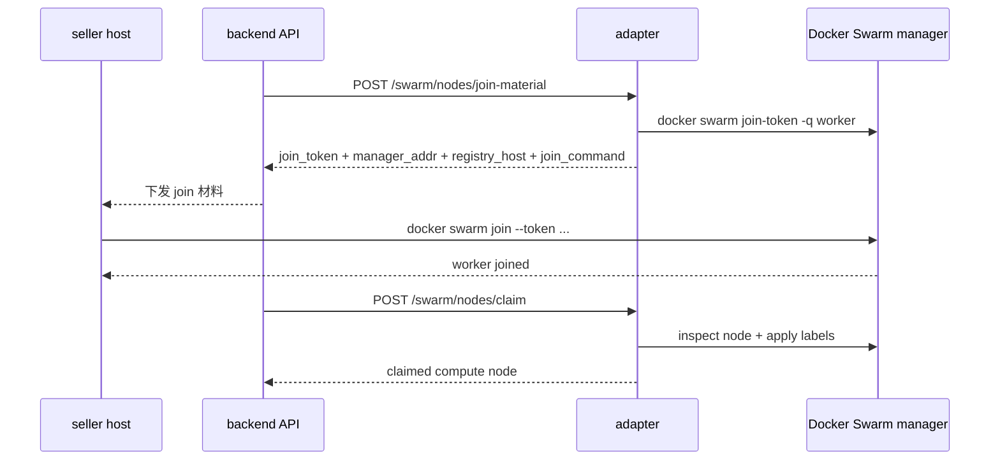

# CodeX Handoff：远端 Docker Swarm Adapter 构建任务

更新时间：`2026-04-05`

**让新的 CodeX 能理解我们的算力交易平台需求，你的任务是开始独立构建 `Docker Swarm Adapter`**

## 1. 任务目标

我们要做的不是普通容器管理后台，而是一个最小可运行的算力交易平台控制面。

平台最小闭环如下：

1. 卖家把自己的机器接入平台，成为一个可调度的 `compute node`
2. 卖家把可运行镜像发布到平台
3. 买家购买某个 seller 的运行时使用权
4. 平台在 seller 节点上创建临时 runtime
5. 买家在租期内通过 gateway + WireGuard 进入这个 runtime
6. 到期后平台回收 runtime 和网络租约

为了让这个闭环成立，远端必须有一个明确的基础设施执行层：

- `Docker Swarm` 负责节点调度和 service 生命周期
- `WireGuard` 负责 seller / buyer 的网络租约
- `Adapter` 负责把平台业务动作翻译成 Swarm / WireGuard 操作

这里的关键原则是：

**业务后端不再 SSH 到远端机器执行脚本。**

远端控制动作必须统一进入：

```text
backend API -> adapter HTTP API -> manager host local Docker / WireGuard
```

## 2. 远端环境

下面这些信息是当前要求新 CodeX 直接使用的远端环境信息。

### 2.1 主机信息

- 主机地址：`81.70.52.75`
- SSH 用户：`root`
- SSH 端口：`22`
- SSH 密码：`@navi1001`

这份文档按当前操作要求保留了完整凭据，方便新的远端 CodeX 直接接手。后续正式上线前，应迁移到凭据管理方案并做密码轮换。

### 2.2 远端目录

- Docker Swarm 根目录：`/root/Pivot_network/Docker_Swarm`
- WireGuard 根目录：`/root/Pivot_network/wireguard`
- 新 Adapter 代码与部署资产目标目录：`/root/Pivot_network/Docker_Swarm/Docker_Swarm_Adapter`

### 2.3 当前远端现状

新 CodeX 不需要继承当前实现，但需要知道远端现在的基本状态：

- `pivot-swarm-adapter.service` 当前已经在远端运行，监听 `0.0.0.0:8010`
- `/root/Pivot_network/Docker_Swarm` 下已有：
  - `compose.swarm.yml`
  - `compose.portainer.yml`
  - `compose.benchmark.yml`
  - `scripts/`
- `/root/Pivot_network/wireguard` 下已有：
  - `wg0.conf`
  - `wg-home.conf`
  - `wireguard-deploy/`
- `/root/Pivot_network/Docker_Swarm/Docker_Swarm_Adapter` 目录目前还是空的，需要新 CodeX 重建为明确的 adapter 项目目录

### 2.4 工作区约束

新 CodeX 的目标不是“修修当前本地仓库”，而是：

- 以远端 `81.70.52.75` 为实际执行环境
- 以 `/root/Pivot_network/Docker_Swarm` 和 `/root/Pivot_network/wireguard` 为基础设施根目录
- 以新的 adapter 设计为主，不以当前本地仓库结构为实现约束

当前本地仓库只能提供两个参考：

- seller / buyer 闭环流程应该长什么样
- 现有 `Docker_swarm/scripts/*.sh` 已经总结出的节点管理规则是什么

## 3. 系统边界

## 3.1 角色分工

| 组件                     | 位置                                        | 职责                                    | 不负责                             |
| ------------------------ | ------------------------------------------- | --------------------------------------- | ---------------------------------- |
| `backend API`          | 平台业务层，可能和Docker Swarm 不在一个机器 | 认证、订单、runtime 会话、计费、状态机  | 不直接执行 Docker / WireGuard 命令 |
| `Docker Swarm Adapter` | 远端 manager 宿主机                         | 执行 Swarm / WireGuard 控制动作         | 不负责订单与登录                   |
| `Docker Swarm manager` | 远端 manager 宿主机                         | 集群管理、service 调度、node 管理       | 不暴露给 seller/buyer 直接调用     |
| `WireGuard server`     | 远端 manager 宿主机                         | 管理 `wg0`、seller peer、buyer peer   | 不负责业务鉴权                     |
| `seller compute node`  | 卖家机器                                    | 承载 `runtime-{id}`、`gateway-{id}` | 不承载平台后端                     |

## 3.2 目标拓扑



## 4. 节点加入为什么必须分两段

这是这个任务里最重要的设计点。

### 4.1 不能把节点加入设计成“adapter 直接替 seller join”

原因很简单：

- `docker swarm join` 必须在 seller 主机自己执行
- 远端 adapter 并不天然拥有 seller 主机的 shell 控制权
- 如果要让 adapter 代替 seller 去 join，就必须额外引入 seller agent、远程命令通道、可信执行链，这会显著扩大系统复杂度

所以 v1 不能把“节点加入”设计成：

```text
backend -> adapter -> 远程命令 seller 主机 -> docker swarm join
```

这条路太重，也不是当前平台最小闭环必须要做的。

### 4.2 正确的 v1 设计

节点加入固定拆成两段：

#### 第一段：平台发加入材料

adapter 提供一个接口，返回：

- worker join token
- manager 地址和端口
- registry 地址
- seller 机器应该执行的加入命令
- seller 节点加入后平台如何认领它的规则

#### 第二段：seller 自己执行 join，然后平台认领节点

seller 主机自己执行：

```bash
docker swarm join --token <token> <manager_addr>:2377
```

加入成功后，adapter 再提供另一个接口来完成：

- 找到刚加入的 node
- 校验它不是 control-plane / manager
- 校验它状态是 `ready`
- 给它打上平台标签
- 建立 `compute_node_id -> seller_user_id` 归属关系

### 4.3 节点加入时序图



结论必须写死：

- adapter 不直接把 seller 主机拉进集群
- adapter 只负责发加入材料和认领节点
- seller 主机自己执行 `docker swarm join`

## 5. 新 Adapter 的接口设计

接口分成两条主线：

- `节点管理主线`
- `交易闭环主线`

节点管理接口优先实现。

## 5.1 节点管理主线

### 1. `GET /health`

用途：

- 返回 adapter 自身是否存活
- 返回 Docker CLI 是否可用
- 返回 Swarm 是否 active
- 返回 WireGuard 基础状态是否可读

最小响应：

```json
{
  "status": "ok",
  "adapter": "swarm-adapter",
  "docker_cli": true,
  "swarm_state": "active",
  "wireguard_readable": true
}
```

### 2. `GET /swarm/overview`

用途：

- 返回 manager、node、service 的摘要
- 供平台查看远端控制面总体状态

最小响应字段：

- `manager_host`
- `swarm.state`
- `swarm.node_id`
- `swarm.node_addr`
- `swarm.control_available`
- `swarm.nodes`
- `swarm.managers`
- `node_list_summary`
- `service_list_summary`

### 3. `GET /swarm/nodes`

用途：

- 返回当前所有 Swarm 节点
- 是平台“节点获取”主接口

最小响应结构：

```json
{
  "nodes": [
    {
      "id": "node-id",
      "hostname": "seller-host-001",
      "role": "worker",
      "status": "ready",
      "availability": "active",
      "platform_role": "compute",
      "compute_enabled": true,
      "compute_node_id": "compute-node-001",
      "seller_user_id": "seller-001",
      "accelerator": "gpu",
      "running_tasks": 2
    }
  ]
}
```

### 4. `POST /swarm/nodes/inspect`

请求：

```json
{
  "node_ref": "seller-host-001"
}
```

用途：

- 返回单节点的详细信息
- 是平台“节点信息检查”主接口

必须返回：

- 节点摘要
- 平台标签
- 原始 labels
- 当前 task 列表
- 最近错误摘要

### 5. `POST /swarm/nodes/join-material`

这是“节点加入”的第一段。

请求：

```json
{
  "seller_user_id": "seller-001",
  "requested_accelerator": "gpu",
  "requested_compute_node_id": "compute-node-001"
}
```

响应必须包含：

- `join_token`
- `manager_addr`
- `manager_port`
- `registry_host`
- `registry_port`
- `swarm_join_command`
- `claim_required`
- `recommended_compute_node_id`
- `recommended_labels`
- `next_step`

示例响应：

```json
{
  "join_token": "SWMTKN-1-xxxx",
  "manager_addr": "81.70.52.75",
  "manager_port": 2377,
  "registry_host": "pivotcompute.store",
  "registry_port": 5000,
  "swarm_join_command": "docker swarm join --token SWMTKN-1-xxxx 81.70.52.75:2377",
  "claim_required": true,
  "recommended_compute_node_id": "compute-node-001",
  "recommended_labels": {
    "platform.role": "compute",
    "platform.compute_enabled": "true",
    "platform.seller_user_id": "seller-001",
    "platform.compute_node_id": "compute-node-001",
    "platform.accelerator": "gpu"
  },
  "next_step": "seller_host_runs_join_then_backend_calls_claim"
}
```

### 6. `POST /swarm/nodes/claim`

这是“节点加入”的第二段。

请求：

```json
{
  "node_ref": "seller-host-001",
  "compute_node_id": "compute-node-001",
  "seller_user_id": "seller-001",
  "accelerator": "gpu"
}
```

必须执行的校验规则：

- 拒绝 control-plane / manager 节点
- 拒绝非 `worker`
- 拒绝非 `ready`
- 拒绝把已归属的 `seller_user_id` 改给别人
- 拒绝把已归属的 `compute_node_id` 改成别的值
- 拒绝整个集群里重复的 `compute_node_id`

成功后必须写入这些标签：

- `platform.managed=true`
- `platform.role=compute`
- `platform.control_plane=false`
- `platform.compute_enabled=true`
- `platform.compute_node_id=<compute_node_id>`
- `platform.seller_user_id=<seller_user_id>`
- `platform.accelerator=<accelerator>`

### 7. `POST /swarm/nodes/availability`

请求：

```json
{
  "node_ref": "seller-host-001",
  "availability": "drain"
}
```

规则固定如下：

- 只允许 `active` 或 `drain`
- control-plane / manager 节点不能被修改
- 非 `worker` 节点不能被修改
- 如果要切到 `drain`，必须先确认这个节点上没有运行中的 replicated workload
- global workload 可以忽略

### 8. `POST /swarm/nodes/remove`

语义固定为：**安全下线**

不是“直接强删”。

请求：

```json
{
  "node_ref": "seller-host-001",
  "remove_from_swarm": true,
  "force": false
}
```

默认处理顺序必须是：

1. inspect 节点
2. 拒绝 control-plane / manager
3. 如果不是 `drain`，先切到 `drain`
4. 再次检查没有运行中的 replicated workload
5. 移除平台标签和平台归属
6. 如果 `remove_from_swarm=true`，执行 `docker node rm`
7. 只有当节点已 down 且常规删除失败时，才允许 `force=true` 走 `docker node rm --force`

这里的“安全下线”要优先于“删除成功率”。

## 5.2 交易闭环主线

新 CodeX 在完成节点管理之后，必须继续理解并预留这些接口，因为它们直接支撑交易闭环：

- `POST /swarm/runtime-images/validate`
- `POST /swarm/nodes/probe`
- `POST /swarm/services/inspect`
- `POST /swarm/runtime-session-bundles/create`
- `POST /swarm/runtime-session-bundles/inspect`
- `POST /swarm/runtime-session-bundles/remove`
- `POST /wireguard/peers/apply`
- `POST /wireguard/peers/remove`

它们的作用分别是：

| 接口                                       | 作用                                      |
| ------------------------------------------ | ----------------------------------------- |
| `/swarm/runtime-images/validate`         | 校验 seller 镜像在指定 node 上能否运行    |
| `/swarm/nodes/probe`                     | 探测 seller node 的 CPU / 内存 / GPU 能力 |
| `/swarm/services/inspect`                | 读取 service 的任务状态、错误、日志       |
| `/swarm/runtime-session-bundles/create`  | 创建 `runtime-{id}` + `gateway-{id}`  |
| `/swarm/runtime-session-bundles/inspect` | 查看 runtime/gateway bundle 当前状态      |
| `/swarm/runtime-session-bundles/remove`  | 删除 runtime/gateway bundle               |
| `/wireguard/peers/apply`                 | 为 seller 或 buyer 发放 WireGuard peer    |
| `/wireguard/peers/remove`                | 回收 seller 或 buyer 的 WireGuard peer    |

这些接口虽然不是节点管理第一阶段的重点，但必须出现在 handoff 里，因为新的 CodeX 应该按完整 adapter 蓝图来规划项目结构，而不是只做一个“节点脚本 HTTP 化”的小工具。

## 6. 当前脚本语义如何翻译成 Adapter API

当前本地仓库里有一批 Swarm 脚本，新 CodeX 只需要继承它们表达出来的“规则”，不需要继承它们的壳层实现。

### 脚本到接口的映射

| 现有脚本语义                         | 新接口                                     |
| ------------------------------------ | ------------------------------------------ |
| `print-compute-node-onboarding.sh` | `POST /swarm/nodes/join-material`        |
| `label-compute-node.sh`            | `POST /swarm/nodes/claim`                |
| `inspect-node.sh`                  | `POST /swarm/nodes/inspect`              |
| `set-node-availability.sh`         | `POST /swarm/nodes/availability`         |
| `remove-local-seller-node.sh`      | 只作为 remove 的参考语义，不能原样直接照搬 |

### 必须继承的安全规则

新 CodeX 必须保留这些规则：

- 不能把 manager/control-plane 当 compute node claim
- 不能把同一个 `compute_node_id` 分配给多个节点
- 不能抢占别人已经 claim 的 seller node
- 不能在节点上仍有 replicated workload 时直接 drain / remove

## 7. 实现阶段

新的 CodeX 应按下面顺序开工，不要一开始就同时做所有东西。

### 阶段 1：把 Adapter 明确定义为远端常驻 HTTP 服务

目标：

- 运行在 `81.70.52.75` manager 宿主机
- 监听 `:8010`
- 只在远端本地执行 Docker / WireGuard
- 不以 Swarm service 形式运行

落地点：

- 项目目录：`/root/Pivot_network/Docker_Swarm/Docker_Swarm_Adapter`
- 部署形式：`systemd` 常驻服务

### 阶段 2：先完成节点管理主线

必须先做：

- `GET /health`
- `GET /swarm/overview`
- `GET /swarm/nodes`
- `POST /swarm/nodes/inspect`
- `POST /swarm/nodes/join-material`
- `POST /swarm/nodes/claim`
- `POST /swarm/nodes/availability`
- `POST /swarm/nodes/remove`

这是第一阶段最核心的交付。

### 阶段 3：接 runtime bundle

继续实现：

- `POST /swarm/runtime-images/validate`
- `POST /swarm/nodes/probe`
- `POST /swarm/services/inspect`
- `POST /swarm/runtime-session-bundles/create`
- `POST /swarm/runtime-session-bundles/inspect`
- `POST /swarm/runtime-session-bundles/remove`

### 阶段 4：接 WireGuard peer 控制

最后实现：

- `POST /wireguard/peers/apply`
- `POST /wireguard/peers/remove`

并把 buyer / seller 的网络租约接入 session 生命周期。

## 8. 新 CodeX 必须理解的业务闭环

新的 CodeX 不需要先理解所有支付、前端细节，但必须理解最小 seller / buyer 闭环。

### 8.1 卖家闭环

```text
seller 注册
-> seller 请求 join 材料
-> seller 主机自己执行 docker swarm join
-> 平台 claim 节点并打标签
-> seller push 镜像
-> 平台校验镜像并探测节点能力
-> 平台把镜像变成 offer
```

### 8.2 买家闭环

```text
buyer 下单
-> 平台创建 runtime session
-> adapter 创建 runtime + gateway
-> adapter 发 buyer WireGuard peer
-> buyer 通过 gateway + wg-buyer 访问 runtime
-> 到期后 adapter 删除 runtime + gateway + buyer peer
```

## 9. 验收标准

新 CodeX 完成第一版 adapter 后，至少要满足下面这些验收标准。

### 节点加入

- 能调用 `POST /swarm/nodes/join-material`
- 返回 join token、manager 地址、registry 地址、join 命令
- 文档和接口都明确：seller 自己执行 `docker swarm join`
- 能调用 `POST /swarm/nodes/claim`
- claim 成功后节点带上正确平台标签

### 节点获取与节点检查

- `GET /swarm/nodes` 能返回节点列表
- `POST /swarm/nodes/inspect` 能返回单节点详细信息、labels、tasks

### 节点安全下线

- `POST /swarm/nodes/availability` 能正确执行 `active/drain`
- `POST /swarm/nodes/remove` 默认走安全下线工作流
- 不允许直接把 control-plane 删除
- 不允许忽略 replicated workload 直接强删

### 交易闭环预留

- 项目结构里已经预留 runtime bundle 与 WireGuard peer 接口
- 不把 adapter 误做成仅仅服务节点管理的工具

## 10. 最后的指令

给新的 CodeX 的任务定义可以归纳为一句话：

**在远端 `81.70.52.75` 上，以 `/root/Pivot_network/Docker_Swarm/Docker_Swarm_Adapter` 为根目录，构建一个新的常驻 HTTP adapter，先完成节点管理主线，再扩展到 runtime bundle 与 WireGuard 控制，并且把“节点加入”固定实现为“join-material -> seller 自己 join -> claim 节点”。**

如果在实现过程中出现“是不是让 adapter 直接去 SSH 卖家机器执行 `docker swarm join`”这种想法，默认答案是：

**不要。**

当前 v1 正确路径始终是：

- adapter 发加入材料
- seller 自己 join
- adapter 再认领节点

这就是这个任务最重要的设计边界。