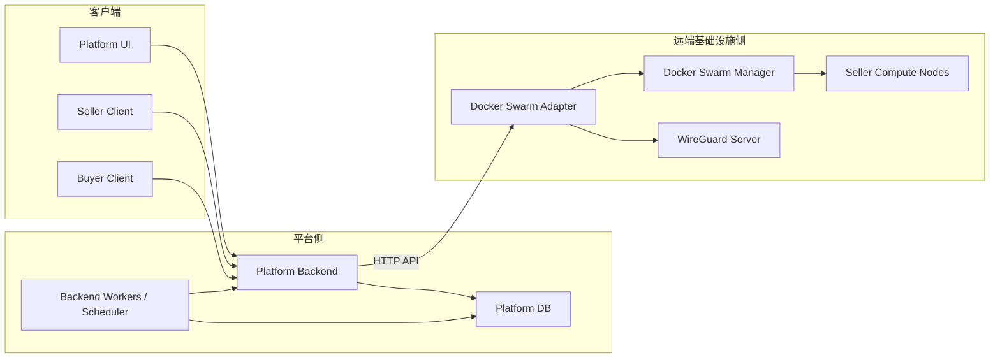
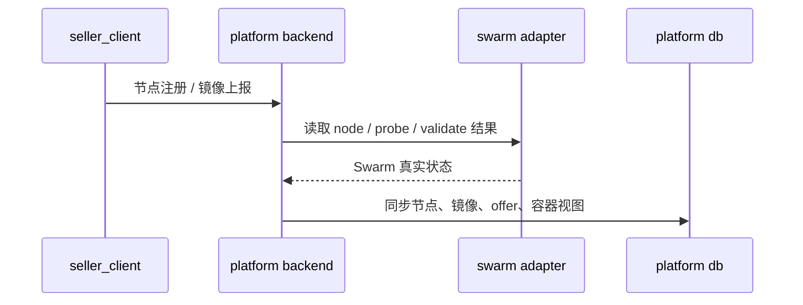
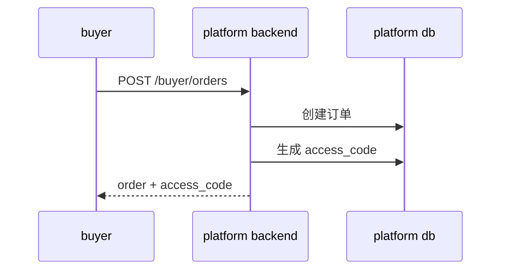
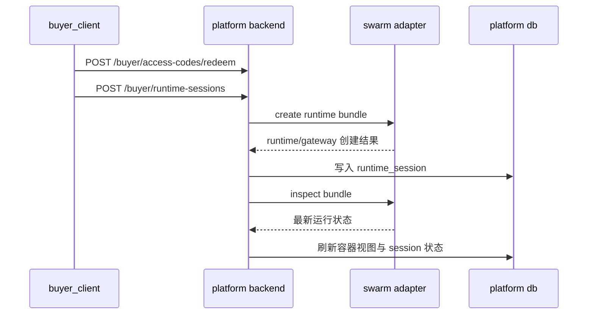

# 独立平台后端设计文档

更新时间：`2026-04-05`

这份文档描述的是一个**独立的平台后端**应该如何设计，而不是当前本地开发骨架应该如何运行。

这里的“独立平台后端”有两个前提：

- 平台后端默认**不与 Docker Swarm Manager 跑在同一台机器上**
- 平台后端**不能直连 Docker Swarm**，也不能通过 SSH 直接执行 `docker` 命令

平台后端与远端基础设施之间的唯一入口是：

```text
Platform Backend <-> Docker Swarm Adapter <-> Docker Swarm / WireGuard
```

## 1. 设计目标

这套独立平台后端不是一个简单的用户系统，而是一个算力交易平台的业务控制层。

它至少要完成下面这些能力：

- 用户注册、登录、会话鉴权
- 从 Adapter 读取 Docker Swarm 状态，并同步到平台数据库
- 定时刷新节点、service、task、runtime/gateway 运行状态
- 提供“容器列表 / 容器详情”的平台查询接口
- 提供 seller 供给与商品化相关接口
- 提供 buyer 下单接口，并返回接入验证码 / 接入码
- 提供接入码兑换与 runtime session 创建接口
- 记录平台审计事件、同步结果、错误原因、状态变化

这份文档的核心观点是：

- 平台后端负责**业务模型**
- Adapter 负责**基础设施读写**
- 数据库负责**同步后的查询模型和业务状态**

## 2. 部署拓扑

平台后端默认与 Swarm Manager 不同机部署，因此它必须把 Adapter 视为远端基础设施 API，而不是把 Docker Socket 当成本地资源。

### 2.1 目标拓扑



### 2.2 固定架构结论

- 平台后端不直连 Docker Swarm Manager
- 平台后端不通过 SSH 操作远端主机
- 平台后端只通过 Adapter HTTP API 读取和执行基础设施动作
- 平台数据库是平台自己的状态存储
- Swarm / WireGuard 的真实运行状态以 Adapter 返回结果为准

## 3. 系统边界

## 3.1 Platform Backend 负责什么

平台后端负责：

- 用户、角色、会话、鉴权
- seller / buyer / admin 业务 API
- 节点、容器、offer、订单、接入码、runtime session 的业务状态机
- 定时同步 Adapter 返回的 Swarm 状态
- 数据库存储、读模型构建、查询接口
- 审计、日志、重试、错误记录

平台后端不负责：

- 本地执行 Docker CLI
- 直接访问 Docker Socket
- 直接修改 WireGuard 配置
- 直接操作 Swarm Manager 上的 service / node / task

## 3.2 Adapter 负责什么

Adapter 负责：

- 返回节点列表、节点详情、service 列表、service 详情、task 状态
- 返回 runtime / gateway 运行状态
- 返回镜像校验与节点能力探测结果
- 执行 runtime bundle 创建、检查、删除
- 执行 WireGuard peer apply / remove
- 执行节点加入材料下发、节点 claim、节点下线

Adapter 不负责：

- 登录注册
- 下单
- 接入码签发
- 钱包与支付
- 平台数据库写入

## 4. 状态主源与同步原则

这一节是整份文档最重要的设计原则。

## 4.1 最终真相源

下面这些状态，**Adapter / Swarm** 是最终真相源：

- 节点是否存在
- 节点 `role`
- 节点 `availability`
- 节点 labels
- service 是否存在
- service 副本状态
- task 当前状态
- runtime / gateway 是否 running / failed / removed
- 最近错误和日志摘要
- WireGuard 租约是否已被应用 / 删除

平台数据库不是这些状态的“发明者”，只是这些状态的同步读模型。

### 4.2 数据库的定位

数据库负责保存两类信息：

#### A. 平台业务主数据

- 用户
- seller profile
- buyer profile
- 节点归属关系
- 镜像和商品
- 订单
- 接入码
- runtime session 业务状态
- 审计日志

#### B. Swarm 同步读模型

- `swarm_nodes`
- `swarm_services`
- `swarm_tasks`
- runtime/gateway 同步快照
- 最近同步结果
- 最近错误摘要

### 4.3 冲突处理原则

如果数据库与 Adapter 返回的基础设施状态不一致：

- 以 Adapter / Swarm 为准
- 平台后端更新数据库中的同步域数据
- 记录一次 `swarm_sync_event` 或 `operation_log`

不能因为 seller 客户端或旧数据库记录说“它应该存在”，就忽略 Adapter 说“service 已经不存在”。

### 4.4 同步机制

同步机制固定采用：

- 定时轮询全局同步
- 关键操作后即时刷新

不能依赖 seller 或 buyer 的自报结果作为最终运行态。

## 5. 核心模块设计

## 5.1 认证与权限模块

负责：

- 注册
- 登录
- token 鉴权
- 用户角色

角色至少分成三类：

- `admin/platform`
- `seller`
- `buyer`

平台后端要能根据角色控制不同视图和 API 访问范围。

## 5.2 Swarm 同步模块

这是独立平台后端的核心模块之一。

它负责：

- 拉取 Adapter 中的 node / service / task / runtime 状态
- 同步进数据库
- 记录同步结果
- 暴露平台查询接口

它至少要有三种同步模式：

### A. 全量同步

定时执行，例如每 30s / 60s：

- 同步节点列表
- 同步 service 列表
- 同步 task 列表
- 同步 runtime/gateway 关键状态

### B. 关键对象刷新

在这些动作发生后立刻刷新：

- 节点 claim
- 节点下线
- 镜像发布后 probe
- buyer 下单
- runtime 创建
- runtime 停止

### C. 单对象查询刷新

当用户查看某个容器详情、某个节点详情、某个 runtime 详情时：

- 如果缓存过旧，先主动向 Adapter 拉一次最新状态

## 5.3 容器视图模块

这里的“容器列表 / 容器详情”在平台后端中必须被明确定义。

### 平台中的“容器”是什么

平台中的容器视图不是：

- 卖家自报出来的本机容器列表
- registry 中的镜像列表

平台中的容器视图指的是：

- 从 Adapter/Swarm 同步出来的 `service/task/runtime/gateway` 运行实例视图

也就是说，它本质上是 Swarm 运行态的业务视图。

### 容器列表至少要包含

- 容器类型：`runtime` / `gateway` / `other service`
- 对应 service 名称
- 对应 task 状态
- 所属 seller node
- 对应 buyer / order / access_code / session
- 当前状态
- 最近更新时间
- 最近错误摘要

### 容器详情至少要包含

- service 摘要
- task 列表
- 当前 node
- 创建时间
- 当前状态
- logs 摘要
- 错误摘要
- 关联业务对象：
  - offer
  - order
  - access_code
  - runtime_session

## 5.4 卖家供给模块

负责：

- 节点注册
- 节点认领状态查询
- 镜像上报
- 镜像校验 / 节点探测结果读取
- offer 发布与状态查询

这里必须注意：

- 卖家上报镜像只是“声明”
- 平台是否把它变成可售卖 offer，要以 Adapter 返回的校验和探测结果为准

## 5.5 订单与接入码模块

这版独立平台后端的买家最小闭环不是钱包充值，而是：

```text
下单 -> 返回接入验证码 / 接入码 -> 接入码兑换 -> 创建 runtime session
```

### 订单模块负责

- 创建订单
- 记录订单绑定的 offer
- 生成订单号
- 固化价格快照
- 记录订单状态

### 接入码模块负责

- 生成接入码
- 将接入码绑定到订单
- 设置过期时间
- 标记已发放 / 已兑换 / 已过期 / 已撤销

接入码是买家进入 runtime 的平台授权凭证，不应直接等同于 runtime session token。

## 5.6 Runtime Session 模块

负责：

- 由订单 / 接入码发起 runtime session 创建
- 向 Adapter 请求创建 `runtime + gateway` bundle
- 记录 session 状态
- 记录 gateway 信息
- 记录 WireGuard 租约信息
- 停止 / 回收 session

session 状态至少要支持：

- `created`
- `provisioning`
- `running`
- `stopping`
- `stopped`
- `failed`
- `expired`

## 5.7 审计与运营模块

负责记录：

- 谁做了什么操作
- 同步发生了什么变化
- 为什么失败
- 哪些对象状态被回写

这里至少需要：

- `activity_events`
- `operation_logs`

## 5.8 定时任务模块

后台必须有定时任务，不然平台数据库会逐渐偏离 Swarm 实际状态。

至少包括：

- `swarm_state_sync_worker`
- `runtime_refresh_worker`
- `expired_access_code_reaper`
- `runtime_session_reaper`
- `offer_probe_refresh_worker`

## 6. API 设计

接口按三层划分：

- `admin/platform`
- `seller`
- `buyer`

## 6.1 Admin / Platform API

### 认证

- `POST /auth/register`
- `POST /auth/login`

### 平台总览

- `GET /platform/overview`
- `GET /platform/swarm/overview`
- `POST /platform/swarm/sync`

### 节点视图

- `GET /platform/nodes`
- `GET /platform/nodes/{node_id}`

### 容器视图

- `GET /platform/containers`
- `GET /platform/containers/{container_id}`

### 业务总览

- `GET /platform/offers`
- `GET /platform/orders`
- `GET /platform/activity`

### 会话刷新

- `POST /platform/runtime-sessions/{session_id}/refresh`

## 6.2 Seller API

Seller API 至少包含：

- 节点注册与 node token
- 节点 claim 状态查看
- 卖家自己的节点列表与节点详情
- 镜像上报
- offer 发布 / probe 状态读取
- 卖家自己的容器视图查询

建议最小接口集：

- `POST /seller/node-registration-tokens`
- `POST /seller/nodes/register`
- `GET /seller/nodes`
- `GET /seller/nodes/{node_id}`
- `GET /seller/nodes/{node_id}/claim-status`
- `POST /seller/images/report`
- `GET /seller/images`
- `GET /seller/offers`
- `GET /seller/containers`
- `GET /seller/containers/{container_id}`

## 6.3 Buyer API

Buyer 最小闭环接口应围绕“订单 + 接入码 + session”设计。

至少包含：

- `GET /buyer/catalog/offers`
- `POST /buyer/orders`
- `GET /buyer/orders/{order_id}`
- `POST /buyer/orders/{order_id}/issue-access-code`
  或者在下单时直接返回 access code
- `POST /buyer/access-codes/redeem`
- `POST /buyer/runtime-sessions`
- `GET /buyer/runtime-sessions/{session_id}`
- `POST /buyer/runtime-sessions/{session_id}/stop`

建议解释如下：

### `POST /buyer/orders`

作用：

- 创建订单
- 固化价格快照
- 可选直接签发 access code

### `POST /buyer/orders/{order_id}/issue-access-code`

作用：

- 为订单签发独立的 access code
- 接入码与 runtime session 解耦

### `POST /buyer/access-codes/redeem`

作用：

- 验证 access code 是否有效
- 返回是否允许创建 runtime session

### `POST /buyer/runtime-sessions`

作用：

- 根据订单 / access code 创建 runtime session
- 后端调用 Adapter 创建 runtime/gateway bundle

## 7. 数据库字段设计

下面给出独立平台后端的主要数据域和字段方向。

## 7.1 身份与权限域

### `users`

核心字段：

- `id`
- `email`
- `password_hash`
- `display_name`
- `role`
- `status`
- `created_at`
- `updated_at`

### `session_tokens`

核心字段：

- `id`
- `user_id`
- `token`
- `expires_at`
- `revoked`
- `created_at`

### `seller_profiles`

核心字段：

- `id`
- `user_id`
- `status`
- `display_name`
- `created_at`

### `buyer_profiles`

核心字段：

- `id`
- `user_id`
- `status`
- `display_name`
- `created_at`

## 7.2 Swarm 同步域

### `swarm_clusters`

核心字段：

- `id`
- `cluster_key`
- `adapter_base_url`
- `manager_host`
- `status`
- `last_synced_at`

### `swarm_nodes`

核心字段：

- `id`
- `cluster_id`
- `swarm_node_id`
- `hostname`
- `role`
- `status`
- `availability`
- `platform_role`
- `compute_enabled`
- `compute_node_id`
- `seller_user_id`
- `accelerator`
- `last_seen_at`
- `raw_payload`

### `swarm_node_labels`

核心字段：

- `id`
- `node_id`
- `label_key`
- `label_value`

### `swarm_services`

核心字段：

- `id`
- `cluster_id`
- `swarm_service_id`
- `service_name`
- `service_kind`
- `mode`
- `image`
- `desired_replicas`
- `running_replicas`
- `status`
- `seller_node_id`
- `runtime_session_id`
- `last_synced_at`
- `raw_payload`

### `swarm_tasks`

核心字段：

- `id`
- `service_id`
- `swarm_task_id`
- `node_id`
- `desired_state`
- `current_state`
- `error_message`
- `container_id`
- `last_synced_at`
- `raw_payload`

### `swarm_sync_runs`

核心字段：

- `id`
- `sync_scope`
- `started_at`
- `finished_at`
- `status`
- `nodes_changed`
- `services_changed`
- `tasks_changed`
- `error_summary`

### `swarm_sync_events`

核心字段：

- `id`
- `sync_run_id`
- `entity_type`
- `entity_key`
- `change_type`
- `before_payload`
- `after_payload`
- `created_at`

## 7.3 卖家供给域

### `image_artifacts`

核心字段：

- `id`
- `seller_user_id`
- `swarm_node_id`
- `repository`
- `tag`
- `digest`
- `registry`
- `status`
- `created_at`

### `image_offers`

核心字段：

- `id`
- `seller_user_id`
- `swarm_node_id`
- `image_artifact_id`
- `runtime_image_ref`
- `offer_status`
- `probe_status`
- `probe_measured_capabilities`
- `current_billable_price`
- `pricing_error`
- `last_probed_at`

### `offer_price_snapshots`

核心字段：

- `id`
- `offer_id`
- `effective_at`
- `billable_price`
- `price_components`
- `created_at`

### `node_capability_snapshots`

核心字段：

- `id`
- `swarm_node_id`
- `cpu_logical`
- `memory_total_mb`
- `gpu_payload`
- `probe_source`
- `probed_at`

## 7.4 买家交易域

### `buyer_orders`

核心字段：

- `id`
- `buyer_user_id`
- `offer_id`
- `order_no`
- `order_status`
- `issued_hourly_price`
- `requested_duration_minutes`
- `created_at`
- `updated_at`

### `access_codes`

这是这版设计里的关键表。

核心字段：

- `id`
- `order_id`
- `buyer_user_id`
- `access_code`
- `status`
- `issued_at`
- `expires_at`
- `redeemed_at`
- `revoked_at`
- `detail`

状态建议：

- `issued`
- `redeemed`
- `expired`
- `revoked`

### `runtime_sessions`

核心字段：

- `id`
- `buyer_user_id`
- `seller_node_id`
- `offer_id`
- `order_id`
- `access_code_id`
- `runtime_image_ref`
- `runtime_service_name`
- `gateway_service_name`
- `status`
- `gateway_host`
- `gateway_port`
- `network_mode`
- `started_at`
- `expires_at`
- `ended_at`
- `last_synced_at`

### `runtime_session_events`

核心字段：

- `id`
- `session_id`
- `event_type`
- `event_payload`
- `created_at`

## 7.5 网络与接入域

### `wireguard_leases`

核心字段：

- `id`
- `runtime_session_id`
- `lease_type`
- `public_key`
- `client_address`
- `server_interface`
- `status`
- `applied_at`
- `removed_at`

### `gateway_endpoints`

核心字段：

- `id`
- `runtime_session_id`
- `protocol`
- `host`
- `port`
- `status`
- `last_checked_at`

## 7.6 审计与运营域

### `activity_events`

记录业务视角活动。

### `operation_logs`

记录平台与 Adapter 交互、同步和异常。

建议字段：

- `id`
- `operation_type`
- `target_type`
- `target_key`
- `request_payload`
- `response_payload`
- `status`
- `error_message`
- `created_at`

## 8. 定时任务与状态刷新

## 8.1 `swarm_state_sync_worker`

作用：

- 周期性从 Adapter 拉取 node / service / task 状态
- 更新 `swarm_*` 同步域表

## 8.2 `runtime_refresh_worker`

作用：

- 刷新活跃 runtime session
- 更新 gateway / runtime 的当前状态

## 8.3 `expired_access_code_reaper`

作用：

- 把过期未兑换的接入码标记为 `expired`

## 8.4 `runtime_session_reaper`

作用：

- 停止过期 runtime session
- 调用 Adapter 删除 bundle
- 清理 WireGuard lease

## 8.5 `offer_probe_refresh_worker`

作用：

- 对 seller offer 的 probe / capability / pricing 做周期刷新

## 8.6 关键操作后的即时刷新

下面这些操作结束后必须立即刷新对应对象：

- 节点 claim
- 节点下线
- 镜像上报
- offer probe
- buyer 下单
- 接入码兑换
- runtime 创建
- runtime 停止

## 9. 最小闭环时序图

### 9.1 Seller 上架 + 平台同步



### 9.2 Buyer 下单拿接入码



### 9.3 接入码换会话 + 状态刷新



## 10. 待补充能力

这部分是平台后端实现时不能漏掉的内容。

### 10.1 用户角色与权限边界

- admin 能看全局节点、容器、订单、日志
- seller 只能看自己的节点、镜像、offer、容器
- buyer 只能看自己的订单、接入码、runtime session

### 10.2 Adapter 鉴权

平台后端访问 Adapter 必须带内部 token。

至少需要：

- `ADAPTER_BASE_URL`
- `ADAPTER_TOKEN`
- 请求超时
- 重试次数

### 10.3 重试、超时、幂等

平台后端对 Adapter 的调用必须考虑：

- 超时
- 可重试错误
- 幂等写操作
- 同步域重复刷新

特别是：

- `create runtime session`
- `stop runtime session`
- `apply/remove wireguard`

都要设计幂等键或幂等语义。

### 10.4 状态机

必须在文档中明确两个状态机：

#### 订单到接入码

```text
issued -> access_code_issued -> access_code_redeemed -> session_started -> completed
```

#### 接入码到 runtime session

```text
issued -> redeemed -> provisioning -> running -> stopping -> stopped / failed / expired
```

### 10.5 异常处理

至少要覆盖：

- Swarm service 不存在
- task failed
- gateway 不可达
- buyer 过期
- seller 节点 down
- Adapter 暂时不可达
- 数据库同步失败

### 10.6 平台查询视图

平台至少需要这些查询视图：

- 节点列表
- 容器列表
- 容器详情
- seller 商品列表
- buyer 订单列表
- runtime 会话列表

### 10.7 观测与审计

每次同步都应记录：

- 同步来源时间
- Adapter 响应摘要
- 变化数量
- 失败原因

## 11. 结论

独立平台后端的本质不是“再包一层 UI API”，而是：

- 以平台数据库承载业务状态
- 以 Adapter/Swarm 作为基础设施真相源
- 以同步机制把远端基础设施状态变成平台可查询、可审计、可交易的业务模型

以后如果平台后端仍然尝试：

- 直接 SSH 到 Swarm Manager
- 直接访问 Docker Socket
- 依赖 seller 自报容器状态作为最终依据

那么它就不符合这份独立平台后端设计文档。