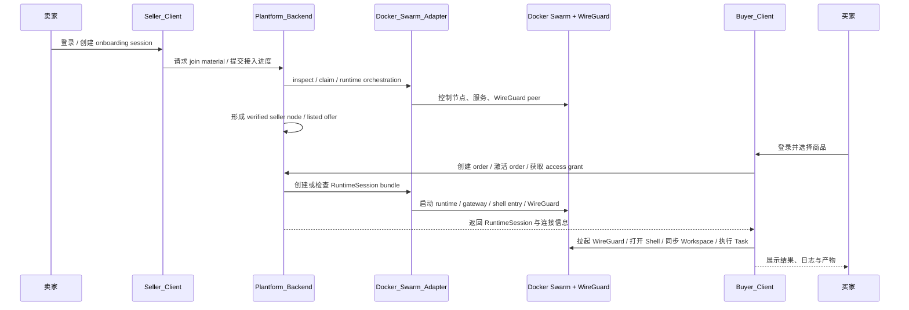
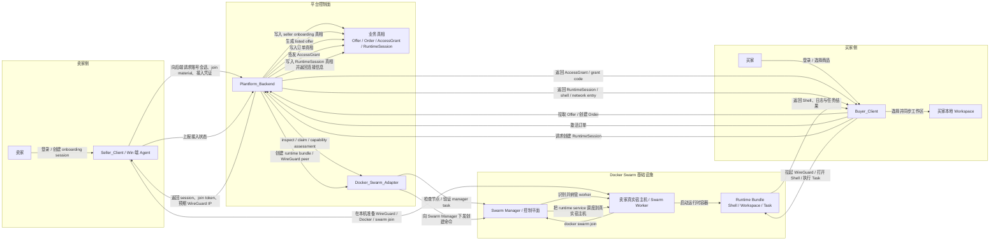
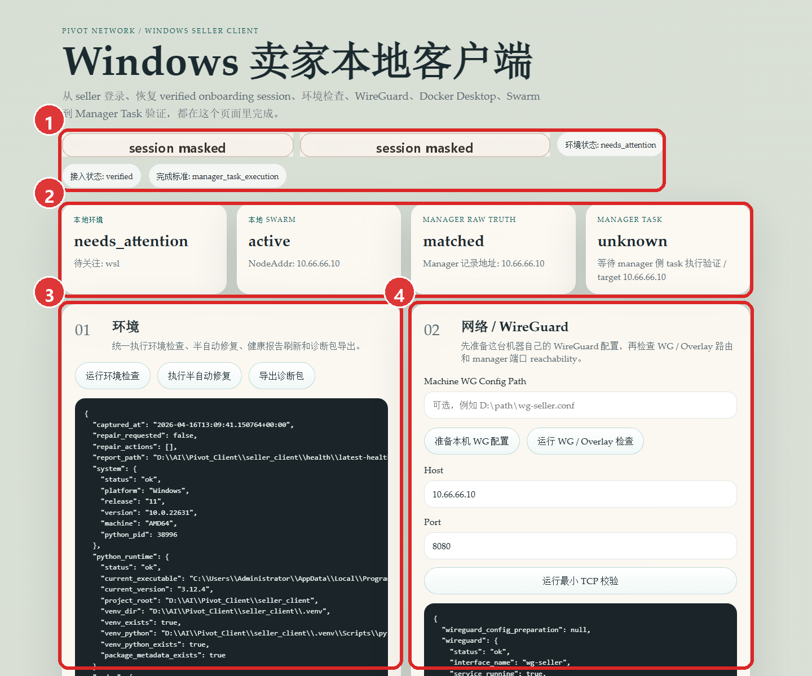
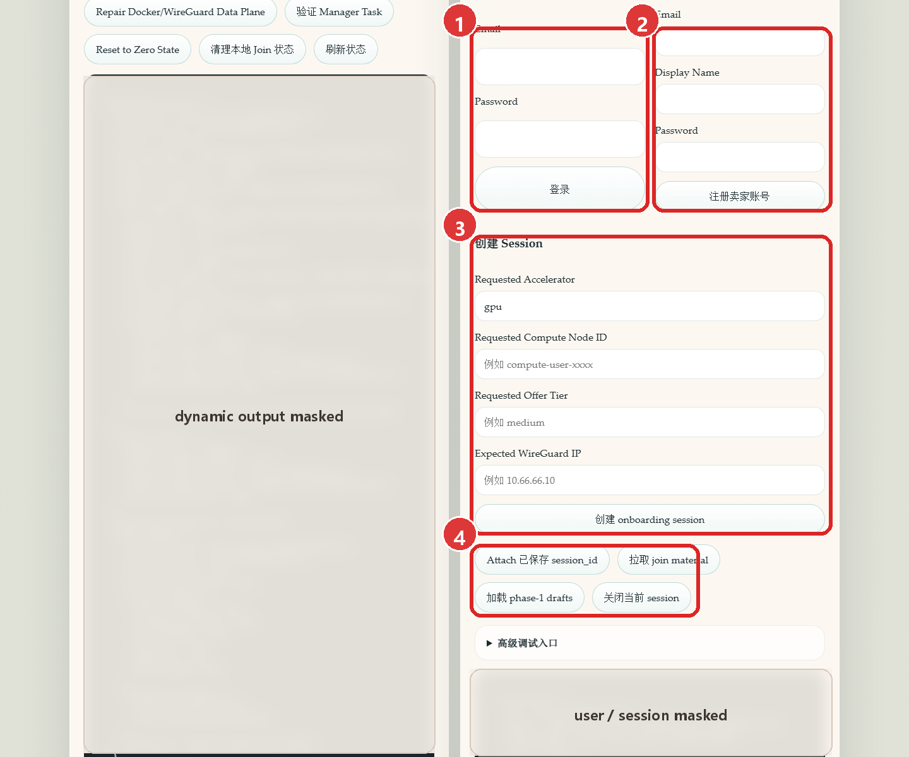
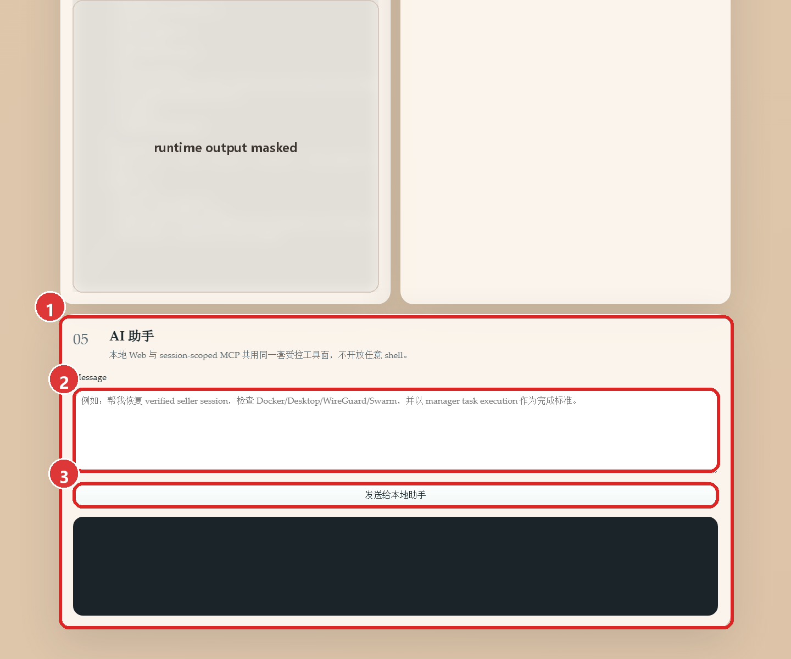
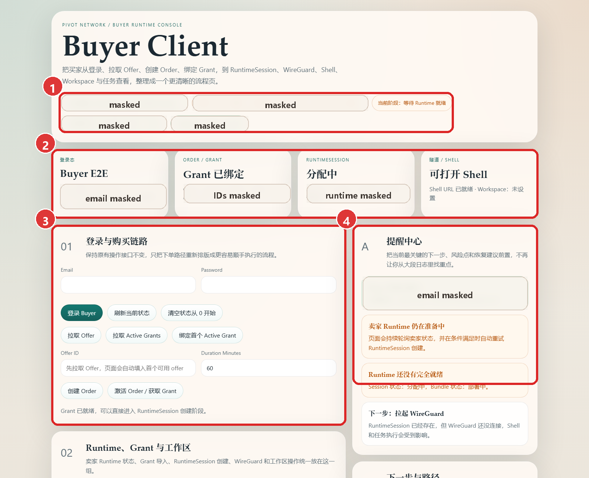
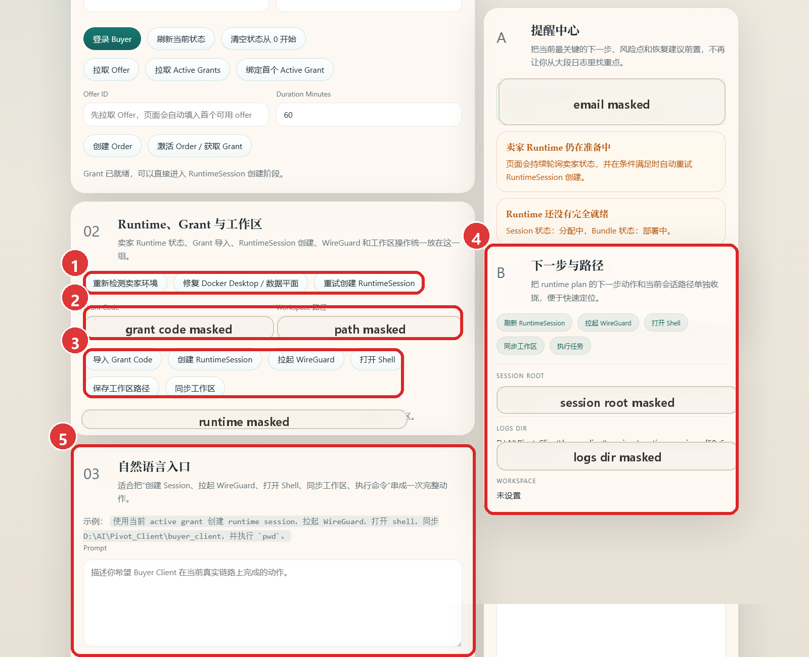
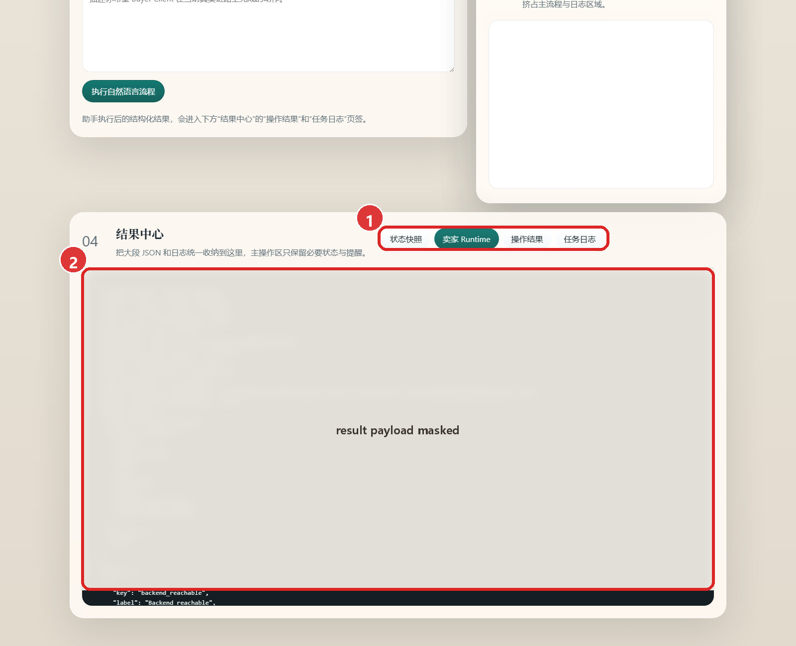

# Pivot Network 老师讲解文档

本文用于给老师从 0 理解这个项目，并按当前本机 live 页面完成一次手动讲解。

当前 UI 真相来源：

- Seller 页面：`http://127.0.0.1:8901/`
- Buyer 页面：`http://127.0.0.1:8902/`

讲解口径说明：

- 本文按按完整 seller -> buyer 成功链路来解释系统设计。
- 页面截图来自当前 live 页面，但截图中的动态账号、session、grant、结果输出都已经做了脱敏处理。

## 1. 项目一句话说明

`Pivot Network` 是一个“个人算力交易平台”原型系统。

它要解决的问题是：卖家把自己的算力节点接入平台，平台把它商品化为可售资源，买家下单后获得一个可用的运行时会话，通过 `WireGuard + Shell + Workspace + Task` 来真正使用这台算力。

最重要的一句话是：

- 买家不是直接 SSH 到卖家宿主机，而是消费平台编排出来的 `RuntimeSession`。

## 2. 为什么用 Docker Swarm + Win 端 Agent 接入来降低操作门槛

这个项目在接入方案上，故意选择了 `Docker Swarm + Windows 端 Agent` 这条路线，核心目标不是炫技，而是降低卖家接入门槛。

1. 很多普通卖家的主力机器本来就是 Windows。
   - 如果要求他们先切到 Linux、再手工装一整套容器和网络环境，门槛会很高。
   - 所以项目提供 `Win 端 Agent`，让卖家直接在自己熟悉的 Windows 环境里完成接入。
2. `Win 端 Agent` 把复杂操作收口成页面和受控动作。
   - 卖家不需要自己背大量命令。
   - 环境检查、WireGuard 准备、Swarm 加入、状态恢复、AI 助手入口都统一放在一个本地客户端里。
3. 选择 `Docker Swarm` 是为了把底层资源组织方式标准化。
   - 平台不直接把“某台裸机”暴露给买家。
   - 而是把卖家机器纳入统一编排体系，再生成标准化的运行时资源和会话。
4. 这样做能把“接入一台机器”变成“接入一个平台节点”。
   - 对卖家来说，操作更像安装一个 Agent，而不是自己维护整套基础设施。
   - 对平台来说，后续商品化、调度、网络接入和 runtime 管理都会更统一。

所以，第 2 节的重点不是“我们为什么做平台”这个宏观问题，而是：

- 我们为什么要用 `Docker Swarm + Win 端 Agent` 这套方案，把卖家的接入成本压低，让普通用户也能把自己的机器接入平台。

## 3. 角色与核心对象

### 3.1 两类角色

- `Seller`
  - 提供算力的人。
  - 通过本地 `Seller_Client` 把自己的机器接入平台。
- `Buyer`
  - 消费算力的人。
  - 通过本地 `Buyer_Client` 下单、进入运行环境、执行任务。

### 3.2 核心对象

- `Offer`
  - 平台把卖家节点商品化之后形成的可售条目。
- `Order`
  - 买家针对某个 `Offer` 创建的订单。
- `AccessGrant`
  - 订单激活后发给买家的“访问授权”，它告诉系统“这个买家现在有资格进入对应资源”。
- `RuntimeSession`
  - 买家真正进入并使用的运行时会话。
  - 这是老师最容易理解成“云主机实例”的对象。
- `WireGuard`
  - 买家进入该运行时会话时使用的安全网络隧道。
- `Shell / Workspace / Task`
  - `Shell`：浏览器或页面中的命令行入口。
  - `Workspace`：买家本地项目目录和远端运行环境之间的工作区。
  - `Task`：在当前会话里执行的命令、脚本和任务结果。

### 3.3 一句话总结这些对象的关系

- 卖家卖的不是“裸机器 IP”，而是平台可编排的算力节点。
- 买家买到的不是“数据库里的一行订单”，而是一个最终可以进入的 `RuntimeSession`。

## 4. 全局架构概览

把整个系统理解成两条连接起来的链：

1. 卖家接入与商品化链
   - `Seller -> Seller_Client -> Plantform_Backend -> Docker_Swarm_Adapter -> Docker Swarm + WireGuard`
2. 买家购买与使用链
   - `Buyer -> Buyer_Client -> Plantform_Backend -> Docker_Swarm_Adapter -> Docker Swarm + WireGuard`

可以这样给老师解释：

- `Seller_Client` 负责把卖家的机器接入平台。
- `Plantform_Backend` 负责记录业务真相，知道哪个卖家通过了验收、哪个商品可售、哪个订单已激活。
- `Docker_Swarm_Adapter` 负责真正去控制底层 Swarm 和 WireGuard。
- `Buyer_Client` 负责让买家完成登录、下单、进入运行时、打开 shell、同步工作区、执行任务。

## 5. 各模块职责说明

| 模块                         | 老师的一句话理解       | 主要职责                                                                                                   |
| ---------------------------- | ---------------------- | ---------------------------------------------------------------------------------------------------------- |
| `Seller_Client`            | 卖家的本地接入控制台   | 卖家登录、环境检查、WireGuard 准备、Swarm 加入、接入会话管理、AI 助手入口                                  |
| `Buyer_Client`             | 买家的本地运行时控制台 | 买家登录、`Offer / Order / Grant`、`RuntimeSession`、`WireGuard`、`Shell`、`Workspace`、任务执行 |
| `Plantform_Backend`        | 平台的业务真相中心     | 账号体系、seller onboarding 真相、`Offer / Order / AccessGrant / RuntimeSession` 业务真相                |
| `Docker_Swarm_Adapter`     | 私有基础设施控制面     | 受控操作 Swarm、WireGuard、runtime bundle，只接受 backend 调用                                             |
| `Docker Swarm + WireGuard` | 底层实际运行环境       | 承载节点、网络隧道、runtime bundle、shell 入口与任务执行环境                                               |

老师如果问“哪个模块最核心”，可以回答：

- 业务真相在 `Plantform_Backend`
- 接入入口在 `Seller_Client`
- 消费入口在 `Buyer_Client`
- 基础设施控制在 `Docker_Swarm_Adapter`
- 真正跑任务的是 `Docker Swarm + WireGuard`

## 6. 的卖家买家全链路文本描述

### 6.1 卖家链路

1. 卖家先在自己的 Windows 机器上安装并启动本地 `Seller_Client`。
2. 卖家在本地运行一键部署脚本准备 `WireGuard` 运行环境。
   - 可以理解成先把这台机器接入平台专用网络的能力准备好。
3. 卖家通过 `Seller_Client` 登录平台后端。
4. 卖家在后端创建一个 `onboarding session`。
   - 这一步相当于告诉平台：“我要接入一台新的卖家节点。”
5. 后端为该卖家 session 返回接入所需凭证和材料。
   - 例如节点身份、join material、推荐标签、预期 `WireGuard IP` 等。
6. 卖家本地 `Win 端 Agent` 根据这些材料执行接入动作。
   - 包括环境检查、准备本机 `WireGuard` 配置、加入 `Docker Swarm`、校验节点是否可被平台识别。
7. 卖家机器成功加入平台控制面后，后端开始验证该节点。
   - 验证通过后，节点会被认定为可用 seller node。
8. 后端继续对该卖家节点做能力评估和商品化。
   - 把节点转成平台可售的 `Offer`。
9. 到这里，卖家侧的任务就完成了。
   - 也就是说，卖家已经把“自己的机器”变成了“平台里可售的算力商品”。

### 6.2 买家链路

1. 买家打开本地 `Buyer_Client` 并登录平台后端。
2. 买家从后端拉取当前可购买的 `Offer` 列表。
3. 买家选择某个 `Offer` 并创建 `Order`。
4. 买家激活订单后，后端签发 `AccessGrant`。
   - 可以把它理解为“进入该资源的访问授权”。
5. 买家在本地 `Buyer_Client` 中绑定这个 `AccessGrant`。
6. 买家基于这个授权创建 `RuntimeSession`。
   - 这一步是把“买到资格”变成“真正可进入的运行时会话”。
7. 后端调用 `Docker_Swarm_Adapter`，在底层 `Docker Swarm + WireGuard` 中编排对应的 runtime bundle。
8. runtime bundle 准备完成后，买家本地拉起 `WireGuard` 隧道。
9. 买家通过页面打开 `Shell`。
10. 买家把自己的项目目录同步到 `Workspace`。
11. 买家在当前会话里执行 `Task`，查看输出、日志和结果。
12. 到这里，买家侧的完整消费链路就完成了。

- 买家真正拿到的，不是卖家宿主机本体，而是平台给他编排好的 `RuntimeSession`。

### 6.3 一句话收束这条链

可以把整条理想链路总结成下面这句话：

- 卖家先通过 `Win 端 Agent + Docker Swarm + WireGuard` 把自己的机器接入平台，平台把它商品化成 `Offer`；买家再通过 `Order -> AccessGrant -> RuntimeSession` 进入一个真正可用的运行环境，并完成 `Shell / Workspace / Task` 这条使用链路。

## 7. 卖家与买家交互时序图



老师可以把这张图理解成一句话：

- 卖家先把供给接进来，平台把供给变成商品，买家再把商品变成一个可以真正进入和使用的运行时会话。

## 8. 端到端流程图



这张图讲的是“真实系统里谁和谁交互”：

- 卖家不是直接把机器暴露给买家，而是先通过 `Seller_Client` 和后端完成接入。
- 后端不是自己直接操作宿主机，而是通过 `Docker_Swarm_Adapter` 去控制 `Swarm Manager`。
- runtime 最终运行在 `Docker Swarm` 纳管的真实宿主机上。
- 买家最终连接的是 `Runtime Bundle`，而不是卖家宿主机本体。

## 9. 实际上手使用流程

### 9.1 现场演示顺序建议

建议现场按这个顺序讲：

1. 先讲卖家页面，因为它代表“供给是怎么进平台的”。
2. 再讲买家页面，因为它代表“买家如何把平台商品变成可用运行时”。
3. 最后回到结果中心，强调买家最终拿到的是 `RuntimeSession + Shell + Workspace + Task`。

---

## 9.2 卖家端页面讲法

### 卖家页面总览



1. 先点哪里：先看顶部状态条。输入什么：这里不输入。功能：解释当前页面的窗口 session、本地保存 session、环境状态、接入状态、完成标准。
2. 先点哪里：再看四张摘要卡。输入什么：这里不输入。功能：快速解释 `本地环境`、`本地 SWARM`、`MANAGER RAW TRUTH`、`MANAGER TASK` 这四个状态板。
3. 先点哪里：指向 `环境` 工作区。输入什么：一般不用先输入，直接可以点 `运行环境检查`、`执行半自动修复`、`导出诊断包`。功能：说明卖家接入之前，先要保证本机运行环境可用。
4. 先点哪里：再指向 `网络 / WireGuard` 工作区。输入什么：可选填写 `Machine WG Config Path`，也可以直接点击 `准备本机 WG 配置`、`运行 WG / Overlay 检查`、`运行最小 TCP 校验`。功能：说明卖家机器必须先准备好本机 WireGuard 配置，才能继续进行 overlay 与 reachability 验证。

### 卖家接入会话区



1. 先点哪里：左侧 `登录` 区。输入什么：输入卖家账号 `Email` 和 `Password`，然后点 `登录`。功能：卖家先拿到平台身份，后续所有接入行为都绑定到该卖家账号。
2. 先点哪里：右侧 `注册` 区。输入什么：填写 `Email`、`Display Name`、`Password`，然后点 `注册卖家账号`。功能：如果是第一次演示，可以告诉老师这里就是卖家入驻入口。
3. 先点哪里：中间 `创建 Session` 区。输入什么：`Requested Accelerator` 默认是 `gpu`，`Requested Compute Node ID` 填卖家节点标识，`Requested Offer Tier` 可填 `medium`，`Expected WireGuard IP` 填计划分配给卖家节点的 WireGuard 地址。功能：创建一次 seller onboarding session，后续接入动作都围绕这个 session 展开。
4. 先点哪里：底部会话按钮区。输入什么：这里通常不输入，直接根据场景点按钮。功能：`Attach 已保存 session_id` 用于恢复之前的会话，`拉取 join material` 用于获取接入材料，`加载 phase-1 drafts` 用于调试草稿，`关闭当前 session` 用于结束当前接入会话。

### 卖家 AI 助手区



1. 先点哪里：先指给老师看整个 `AI 助手` 工作区。输入什么：此时先不输入。功能：说明这个入口的意义是“一句话驱动整条接入流程”，而不是卖家手敲所有底层命令。
2. 先点哪里：再指向 `Message` 输入框。输入什么：可以输入类似“帮我恢复 verified seller session，检查 Docker/Desktop/WireGuard/Swarm，并以 manager task execution 作为完成标准。” 功能：让老师明白这里是受控工具入口，不是任意 shell。
3. 先点哪里：最后指向 `发送给本地助手`。输入什么：输入好上面的自然语言后点击即可。功能：触发 seller 侧的本地助手，用自然语言串起环境检查、网络检查、接入判断和完成标准验证。

### 卖家侧现场讲解脚本

1. 打开 Seller 页面，先说“这是卖家的本地接入控制台”。
2. 指顶部状态条和四张摘要卡，告诉老师这里负责展示接入当前处于什么阶段。
3. 指 `环境`、`网络 / WireGuard`、`Docker / Swarm`、`接入会话`、`AI 助手` 五个工作区，说明卖家从环境准备到接入控制都在同一页完成。
4. 说明 `登录` / `注册卖家账号` 的作用，告诉老师平台先识别卖家身份，再接入机器。
5. 说明 `创建 onboarding session` 要填的 4 类信息，告诉老师这一步是在创建“卖家接入任务单”。
6. 说明 `Attach 已保存 session_id` 和 `拉取 join material` 的作用，告诉老师这是恢复旧会话和获取接入材料的入口。
7. 最后展示 `AI 助手` 输入框，说明卖家最适合用一句自然语言驱动整条接入流程。

卖家侧适合现场展示的自然语言示例：

```text
帮我恢复 verified seller session，检查 Docker/Desktop/WireGuard/Swarm，并以 manager task execution 作为完成标准。
```

---

## 9.3 买家端页面讲法

### 买家页面总览



1. 先点哪里：先看顶部状态条。输入什么：这里不输入。功能：解释浏览器会话、卖家 runtime 状态、当前阶段、本地会话等买家当前链路状态。
2. 先点哪里：再看四张摘要卡。输入什么：这里不输入。功能：快速解释买家的 `登录态`、`Order / Grant`、`RuntimeSession`、`隧道 / Shell` 当前状态。
3. 先点哪里：指向 `登录与购买链路` 区。输入什么：买家账号 `Email`、`Password`，以及后续可能自动填入的 `Offer ID`、`Duration Minutes`。功能：向老师解释买家从 `登录 Buyer`、`拉取 Offer`、`拉取 Active Grants`、`绑定首个 Active Grant`、`创建 Order` 到 `激活 Order / 获取 Grant` 的全过程。
4. 先点哪里：指向右侧 `提醒中心`。输入什么：这里不输入。功能：这是买家当前最关键的链路提示区，告诉老师系统会把下一步操作和风险点前置显示。

### 买家 Runtime、Grant 与工作区



1. 先点哪里：先看最上方卖家 runtime 控制按钮。输入什么：这里不输入。功能：`重新检测卖家环境`、`修复 Docker Desktop / 数据平面`、`重试创建 RuntimeSession` 代表买家创建运行时时，会先关注卖家侧是否已经准备好。
2. 先点哪里：再看 `Grant Code` 和 `Workspace 路径` 两个输入框。输入什么：如果走手工流程，可以输入 `Grant Code`；如果要同步工作区，可以填写本地项目目录路径。功能：前者用于导入授权，后者用于绑定工作区。
3. 先点哪里：再看动作按钮区。输入什么：通常不需要额外输入，按顺序点击即可。功能：`导入 Grant Code`、`创建 RuntimeSession`、`拉起 WireGuard`、`打开 Shell`、`保存工作区路径`、`同步工作区` 是买家进入实际运行环境的主路径。
4. 先点哪里：指右侧 `下一步与路径` 区。输入什么：这里不输入。功能：集中告诉老师“下一步该做什么”，同时展示 `Session Root`、`Logs Dir`、`Workspace` 这些当前会话路径。
5. 先点哪里：最后看 `自然语言入口`。输入什么：输入完整自然语言任务描述，然后点击 `执行自然语言流程`。功能：适合把创建会话、拉起网络、打开 shell、同步工作区、执行命令一次串起来。

### 买家结果中心



1. 先点哪里：先点顶部标签页。输入什么：这里不输入。功能：`状态快照`、`卖家 Runtime`、`操作结果`、`任务日志` 这 4 个页签分别展示不同层次的结果信息。
2. 先点哪里：再看下方结果输出区。输入什么：这里不输入。功能：这里统一展示状态 JSON、runtime 结果、任务日志，是老师理解“系统最终产出什么”的最好位置。

### 买家侧现场讲解脚本

1. 打开 Buyer 页面，先说“这是买家的本地运行时控制台”。
2. 指顶部状态条、四张摘要卡和提醒中心，说明买家当前链路会被拆成可理解的几个阶段。
3. 讲 `登录与购买链路` 区的顺序：`登录 Buyer` -> `拉取 Offer` -> `创建 Order` -> `激活 Order / 获取 Grant`。
4. 讲 `Runtime、Grant 与工作区` 区的顺序：拿到 `Grant` 后，`创建 RuntimeSession` -> `拉起 WireGuard` -> `打开 Shell` -> `保存工作区路径` -> `同步工作区`。
5. 讲 `自然语言入口` 的意义：如果不想逐个按钮点，可以一句话要求系统“创建 session、拉起 WireGuard、打开 shell、同步工作区、执行命令”。
6. 最后切到 `结果中心`，告诉老师所有真实结果都会回到 `状态快照`、`卖家 Runtime`、`操作结果`、`任务日志` 这几类输出中。

买家侧适合现场展示的自然语言示例：

```text
使用当前 active grant 创建 runtime session，拉起 WireGuard，打开 shell，同步 D:\AI\Pivot_Client\buyer_client，并执行 `pwd`。
```

---

## 9.4 一次完整的手动展示链路

如果现场只讲一次主链路，建议按这个最短顺序：

1. 在 Seller 页面说明五个工作区，重点停留在 `接入会话` 和 `AI 助手`。
2. 解释卖家先登录，再创建 `onboarding session`，然后通过自然语言让本地助手完成接入。
3. 告诉老师 seller 接入完成后，平台会把该卖家节点商品化为 `Offer`。
4. 切到 Buyer 页面，先登录买家。
5. 点击 `拉取 Offer`，说明平台已经有可售资源。
6. 点击 `创建 Order`，说明买家开始购买该资源。
7. 点击 `激活 Order / 获取 Grant`，说明买家拿到访问授权。
8. 在 `Runtime、Grant 与工作区` 区点击 `创建 RuntimeSession`，说明系统开始把“购买资格”变成“实际可进入的运行时”。
9. 再点 `拉起 WireGuard` 和 `打开 Shell`，说明买家已经进入正式运行环境。
10. 最后切到 `结果中心`，告诉老师这就是系统把运行结果、日志和状态统一收口的位置。

---

## 9.5 现场勾选版操作记录

老师演示时可以直接照下面勾：

- [ ] 打开 Seller 页面
- [ ] 讲解顶部状态条和摘要卡
- [ ] 讲解五个工作区
- [ ] 说明 `登录` / `注册卖家账号`
- [ ] 说明 `创建 onboarding session`
- [ ] 说明 `Attach 已保存 session_id` / `拉取 join material`
- [ ] 展示 `AI 助手` 输入框
- [ ] 打开 Buyer 页面
- [ ] 讲解顶部状态条、摘要卡、提醒中心
- [ ] 说明 `登录 Buyer`
- [ ] 说明 `拉取 Offer`
- [ ] 说明 `创建 Order`
- [ ] 说明 `激活 Order / 获取 Grant`
- [ ] 说明 `创建 RuntimeSession`
- [ ] 说明 `拉起 WireGuard`
- [ ] 说明 `打开 Shell`
- [ ] 说明 `同步工作区`
- [ ] 展示 `结果中心`

## 10. 当前局限性与后续建议

这一部分建议主动讲清楚：当前项目已经跑通了 seller -> buyer 的主链路原型，但它还不是一个完全产品化、可大规模部署的系统。现场可以把局限性讲成“已经验证方向，但后续需要工程化收敛”的问题。

### 10.1 AI / MCP 接入还不够稳定

当前页面里的 `AI 助手` 和 `自然语言入口` 可以把多个本地动作串起来，但实际使用时会遇到两个问题：

1. MCP 工具边界限制得比较死，很多操作必须被拆成固定工具调用，灵活性不如直接写一个面向本项目的本地执行器。
2. AI 入口更适合做“受控流程编排”，不适合让它自由处理所有底层异常。
3. 后续建议把 AI 作为辅助入口，把关键动作沉淀成明确的本地 API、状态机和恢复脚本，避免把稳定性寄托在自然语言理解上。

现场解释时可以说：

- 现在 AI 入口证明了“自然语言驱动接入流程”是可行的。
- 但生产化时，核心能力应该靠确定性的工具链和状态机兜底，AI 只负责降低操作门槛。

### 10.2 Windows 侧 WireGuard 组网存在设备差异风险

当前组网依赖 Windows 本地环境、WireGuard、Docker Desktop / WSL、路由和防火墙策略。这一层在不同机器上差异很大，容易出现：

1. WireGuard 服务名、网卡状态、路由表不一致。
2. WSL / Docker Desktop 网络模式不同，导致同样的脚本在不同机器上表现不同。
3. Windows 防火墙、管理员权限、已有 VPN 或安全软件影响 overlay / tunnel 连通性。
4. 机器重启或 Docker Desktop 恢复后，本地看到的状态和真实可用状态可能短暂不一致。

后续更合理的方向是：不要长期依赖手工拼接的 WireGuard / Windows 网络脚本，而是自己实现一套更可控的组网层或 agent 层，把节点身份、隧道配置、路由下发、健康检查和恢复策略统一收口。

现场解释时可以说：

- 现在方案证明了 Windows 卖家节点可以被接入。
- 但 Windows 组网不是这个项目最稳的部分，后续要把它产品化，最好自研或深度封装组网能力。

### 10.3 Docker Swarm 真实状态要以服务器侧为准

当前系统里会出现一个容易误解的点：本地客户端读到的 Docker / Swarm 状态，不一定等于服务器控制面看到的真实状态。

原因是：

1. 本地机器只能看到自己的 Docker Desktop、WireGuard 和部分 join 状态。
2. 服务器侧 Swarm Manager 才知道节点是否真的被纳管、是否能被调度、是否能执行 manager task。
3. 后端和 `Docker_Swarm_Adapter` 看到的是平台控制面的真相，本地页面看到的是“本机视角”。

所以验收标准不能只看本地 `docker info` 或本地按钮结果，而应该以服务器侧的 Swarm Manager / Adapter / Backend 记录为准。尤其是 seller 接入完成标准，应当看：

- backend session 是否进入 `verified`
- adapter 是否能 inspect 到节点
- Swarm Manager 是否能调度并执行验证任务
- backend 是否已经完成 capability assessment 和 offer commercialization

现场解释时可以说：

- 本地状态用于帮助卖家排查环境。
- 平台状态才是最终业务真相。
- 如果两边不一致，以服务器和后端记录为准。

### 10.4 后端、Adapter、Swarm 仍需要更强的一致性设计

当前原型已经把 `Backend -> Adapter -> Swarm` 跑通，但还需要继续加强：

1. 后端业务状态和 Adapter 基础设施状态之间的同步与补偿。
2. runtime session 创建失败、部分成功、重复创建时的幂等处理。
3. Swarm 节点掉线、重连、重启后的自动恢复。
4. WireGuard peer、runtime bundle、workspace、task log 的生命周期清理。
5. 关键操作的审计日志和可回放 evidence。

这部分后续应该从“能跑通”升级为“能自愈、能追踪、能回滚”。

### 10.5 演示时建议主动说明的边界

如果老师问“现在是不是已经可以直接商用了”，建议回答：

- 现在适合作为可运行原型和架构验证。
- seller 接入、offer 商品化、buyer runtime session、shell / workspace / task 这条主线已经被证明可行。
- 但 AI 接入、Windows 组网、Swarm 状态一致性、异常恢复、权限隔离、审计和运维自动化还需要继续工程化。
- 下一阶段重点不是再堆功能，而是把网络、状态一致性、恢复能力和安全边界做扎实。

## 结尾总结

如果老师只记住一句话，建议你最后这样收尾：

`Pivot Network` 做的事情不是简单地“让一台机器远程可登录”，而是把卖家的算力节点接入平台、商品化成 `Offer`，再让买家通过 `Order -> AccessGrant -> RuntimeSession` 真正进入一个可用的运行环境，并在里面完成 `Shell / Workspace / Task` 这条完整使用链路。
