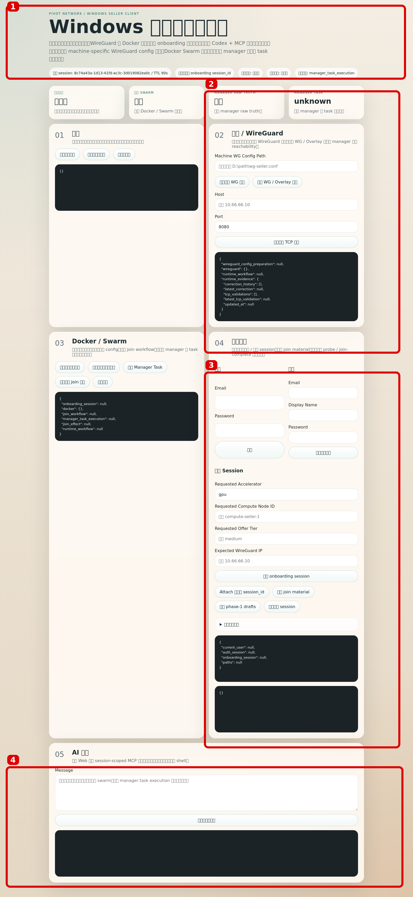
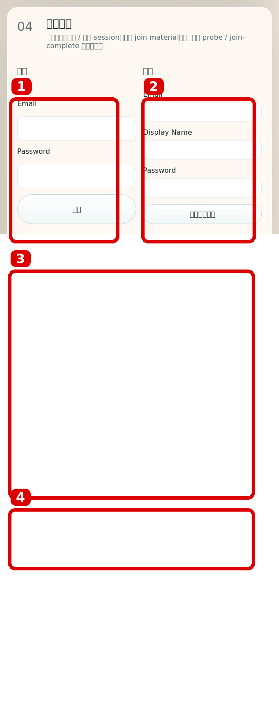
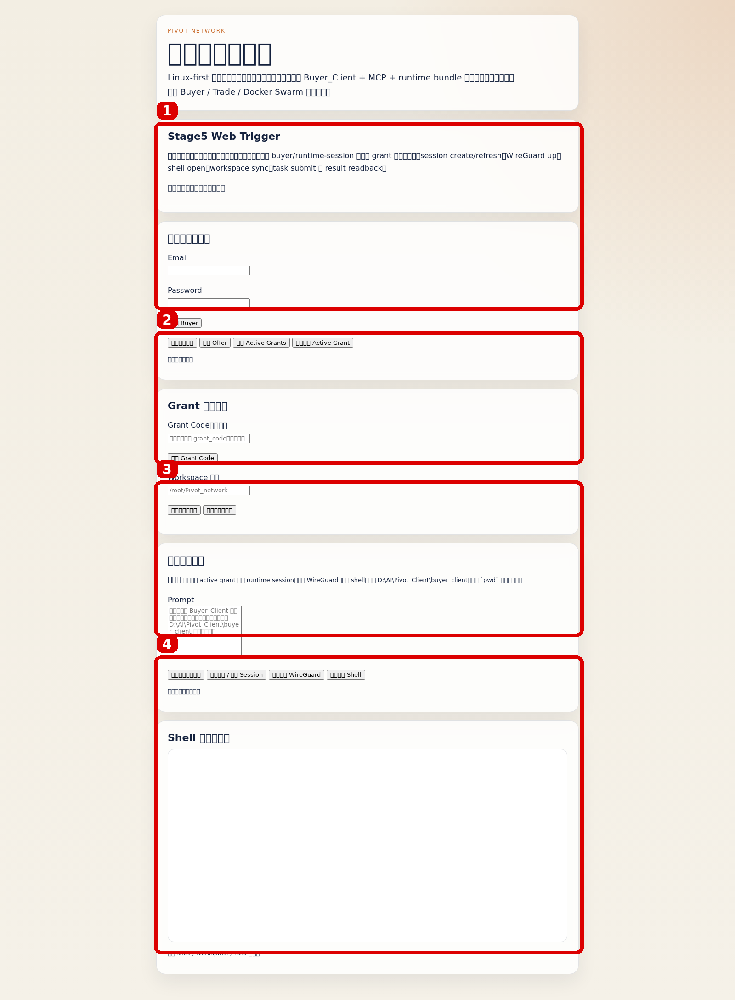
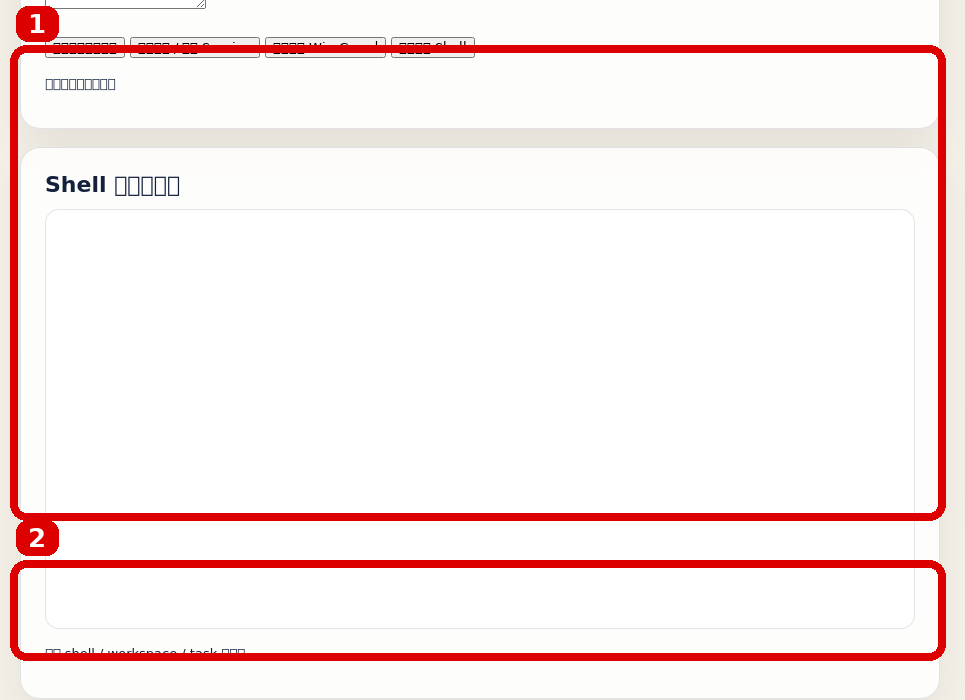

# 卖家 / 买家端到端测试与使用教程

更新时间：`2026-04-12`

## 1. 这份文档给谁看

这份文档面向两个对象：

- 第一次接触项目、需要按图操作的新手
- 需要复现实测 seller -> buyer 端到端链路的人

这份文档重点回答：

- seller 从哪里启动
- buyer 从哪里启动
- 页面上该点哪里
- 端到端成功标准是什么
- 当前我们已经验证过哪些稳定性结论

如果你要看项目当前总体状态，先读：

- `/root/Pivot_network/docs/runbooks/current-project-state-and-execution-guide.md`

## 2. 当前已经真实验证过什么

当前已经真实跑通过的产品链路是：

1. 卖家本地 `Seller_Client` 登录并创建 onboarding session
2. 卖家通过 MCP / AI 助手完成接入
3. backend 将节点验收到 `verified`
4. backend 自动商品化为真实 `listed offer`
5. 买家在本地 `Buyer_Client` 拉取并绑定真实 grant
6. buyer 创建 / 刷新 `RuntimeSession`
7. buyer 拉起 `WireGuard`
8. buyer 打开 shell、同步工作区、执行任务并回读日志

## 3. 卖家端怎么用

### 3.1 卖家端总览



红框说明：

1. 顶部状态总览：先看窗口 session、本地 session、环境状态、接入状态、完成标准。
2. 网络 / WireGuard：先准备这台机器自己的 WireGuard 配置，再做 WG / Overlay 检查。
3. 登录 + 创建 Session：seller 最常用的区域，先登录，再创建 onboarding session。
4. AI 助手：推荐入口。对新手来说，直接用自然语言让它完成接入。

### 3.2 卖家端关键操作区



红框说明：

1. 登录区：已有卖家账号就在这里登录。
2. 注册区：没有账号就在这里注册 seller 账号。
3. 创建 Session：当前 seller 接入必须从 fresh onboarding session 开始。
4. Attach / Join Material：如果已经有保存的 session，可以 attach 并拉取 join material。

### 3.3 卖家端推荐操作顺序

1. 运行 `Seller_Client/bootstrap/windows/install_and_check_seller_client.ps1`
2. 运行 `Seller_Client/bootstrap/windows/start_seller_client.ps1`
3. 打开 seller 页面
4. 先登录或注册
5. 创建 fresh onboarding session
6. 在 AI 助手里输入：

```text
帮我接入
```

或者：

```text
帮我加入 swarm，并以 manager task execution 作为完成标准
```

7. 等待 seller client 完成：
   - WireGuard 配置准备
   - 环境检查
   - join workflow
   - manager task verification
8. backend 将该节点推进到 `verified`
9. backend 自动完成 assessment 和真实 offer 上架

### 3.4 卖家端成功标准

当前 seller 最终成功标准不是本地 `docker info` 显示 active，而是：

- manager 侧确认 worker `Ready`
- manager 侧确认该 worker 上有可运行或已运行中的 swarm task

## 4. 买家端怎么用

### 4.1 买家端总览



红框说明：

1. 登录与当前链路：登录 buyer，拉取 active grants，绑定当前 grant。
2. Grant 与工作区：手工导入 grant code，保存本地 workspace 路径。
3. 自然语言驱动：推荐入口。让 Buyer_Client + MCP 直接驱动 session / WG / shell / workspace / task。
4. Shell 与任务结果：查看 shell iframe 和任务结果输出。

### 4.2 买家端结果区



红框说明：

1. Shell iframe：当前 real session 的 shell 入口。
2. 任务结果：查看 workspace 同步结果、任务输出和日志回读。

### 4.3 买家端推荐操作顺序

1. 启动 buyer 本地客户端
2. 打开页面后先登录 buyer
3. 点击：
   - `拉取 Active Grants`
   - `绑定首个 Active Grant`
4. 如果需要手工输入 grant code：
   - 在 `Grant Code` 输入框中粘贴
   - 点击 `导入 Grant Code`
5. 在 `Workspace 路径` 中填本地目录
6. 推荐直接在“自然语言驱动”里输入：

```text
使用当前 active grant 建立 runtime session，拉起 WireGuard，打开 shell，同步当前工作区，执行 `pwd` 并返回结果。
```

7. 如果要逐步手动执行，也可以按顺序点：
   - `手动创建 / 刷新 Session`
   - `手动拉起 WireGuard`
   - `手动打开 Shell`
   - `手动同步工作区`

## 5. 端到端测试怎么验

### 5.1 Seller -> Offer

验收要点：

- seller onboarding session 最终进入 `verified`
- backend 自动生成或更新真实 `listed offer`
- `/api/v1/offers` 中能看到非 seed 的真实 offer

### 5.2 Buyer -> RuntimeSession

验收要点：

- buyer 可以拉到真实 active grant
- buyer 绑定 grant 后，`create/refresh` 返回同一条真实 `runtime_session_id`
- `wireguard_up` 成功
- `/health` 可读
- shell URL 可打开

### 5.3 Workspace / Task

验收要点：

- `workspace/status` 返回 `200`
- 工作区同步后能在 `/workspace` 看到文件
- 任务执行返回 `exit_code=0`
- 日志回读与任务输出一致

## 6. 稳定性测试结论

### Scenario 1：same-session 重编排

- 会真实降级
- 不会自动恢复到可用态
- 基础设施恢复后，buyer 还需要一次显式 `runtime-sessions/refresh`

### Scenario 2：runtime 短时中断

- 会造成明确的临时不可用
- 基础设施恢复后，buyer 自动恢复
- 不需要手工 refresh / retry

### Scenario 3：网络不稳定

- 是部分退化，不是全挂
- `runtime/current` 仍可读
- `workspace/status` 会在 `200 / 502` 之间抖动
- 抽样 task 仍可能成功
- 故障解除后自动恢复

## 7. 文档入口

如果你只是要使用系统，优先看：

1. 本文
2. `/root/Pivot_network/Seller_Client/README.md`
3. `/root/Pivot_network/Buyer_Client/README.md`

如果你要看更底层语义，再读：

1. `/root/Pivot_network/Seller_Client/docs/current-seller-onboarding-flow-cn.md`
2. `/root/Pivot_network/Buyer_Client/docs/current-buyer-purchase-flow-cn.md`
3. `/root/Pivot_network/Plantform_Backend/README.md`
4. `/root/Pivot_network/Docker_Swarm/Docker_Swarm_Adapter/README.md`
