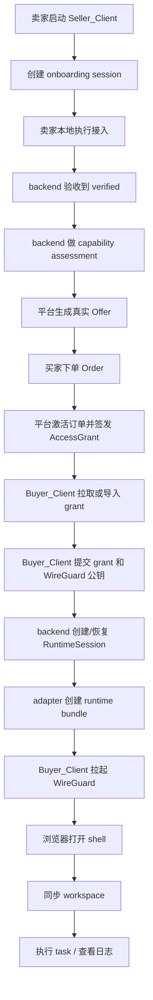
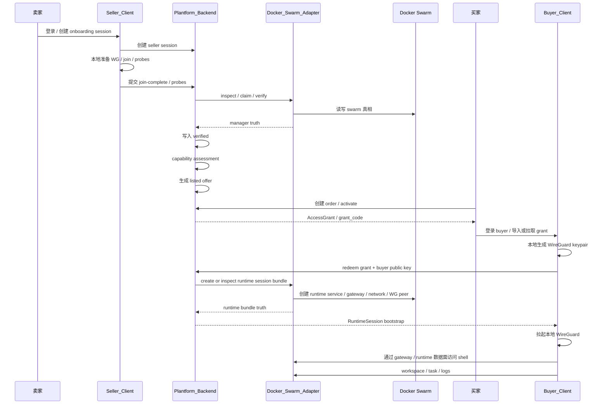

# Pivot Network 项目名词说明

更新时间：`2026-04-12`

## 1. 这份文档解决什么问题

这份文档专门给**不理解底层实现**的同学做扫盲。

它回答两个问题：

1. 项目里这些名词分别是什么意思
2. 卖家和买家“建立连接”这件事，实际上是怎么发生的

这份文档不要求你先懂 `Docker Swarm`、`WireGuard`、`MCP`。
它会先讲概念，再讲流程。

## 2. 一句话先说结论

这个系统里，买家**不是直接 SSH 到卖家宿主机**。

真正发生的是：

- 卖家先把自己的节点接入平台
- 平台把这个节点商品化成一个可售 `Offer`
- 买家购买后，平台为买家创建一个独立的 `RuntimeSession`
- 买家通过本地 `Buyer_Client` 建立 `WireGuard` 隧道
- 然后在浏览器里进入这个 `RuntimeSession` 的 shell

所以，买家从体验上像是在“远程登录一台机器”，
但系统语义上，买家操作的是**平台编排出来的运行时会话**，不是卖家宿主机本体。

## 3. 先用“类 / 实例”的类比理解

可以把这套系统类比成面向对象里的“类”和“实例”。

### 3.1 卖家侧更像“提供能力的类”

卖家接入平台后，平台看到的是：

- 这台节点有多少 CPU / 内存 / GPU
- 能不能被验收到 `verified`
- 能不能被商品化成可售规格

所以 seller 节点本身更像：

- 一个“可提供能力的资源类”

### 3.2 Offer 更像“类的公开商品定义”

当 seller 节点通过验收后，平台会把它自动商品化成 `Offer`。

`Offer` 更像：

- 一个可下单的商品模板

### 3.3 RuntimeSession 更像“实例”

买家真正拿到、真正使用的，不是 seller 节点本身，
而是平台在 buyer 下单后创建出来的：

- `RuntimeSession`

它更像：

- 根据某个 `Offer` 创建出来的一个具体实例

所以：

- seller 节点：原始资源
- offer：可售模板
- runtime session：买家正在使用的实例

### 3.4 TaskExecution 更像“实例上的一次方法调用”

买家在当前会话里执行命令、跑任务、看日志，
这些都不是新的资源对象，
而是：

- 当前 `RuntimeSession` 上的一次运行记录

## 4. 关键名词解释

### 4.1 Seller / 卖家节点

卖家的机器接入平台后，会成为候选算力节点。

重点：

- 卖家机器不是直接暴露给买家的 SSH 主机
- 它首先要经过平台验收和商品化

### 4.2 Verified Node

指 backend 已经确认这台 seller 节点满足接入标准。

当前标准不是“本地 docker active”，而是：

- manager 侧确认 worker `Ready`
- manager 侧确认这台 worker 上有真实 task 可运行 / 已运行

### 4.3 Capability Assessment

平台对这台 verified 节点做能力测算：

- 能卖什么规格
- 是否可售

### 4.4 Offer

平台自动生成的真实商品。

它是 buyer 在平台前端看到并下单的对象。

### 4.5 Order

买家下的订单。

它表示：

- 我买了哪个 Offer
- 我打算使用多久

### 4.6 AccessGrant

会话准入凭证。

你可以把它理解成：

- “允许这个 buyer 去创建 / 恢复 RuntimeSession 的门票”

### 4.7 RuntimeSession

买家真正使用的“云主机会话”。

它在平台内部对应一整套运行时组件：

- runtime service
- gateway service
- session overlay network
- buyer WireGuard lease

### 4.8 WireGuard Lease

平台给 buyer 这条会话分配的一条 WireGuard 租约。

### 4.9 Gateway Service

运行在 manager 侧的入口代理，负责把 buyer 进来的请求转发到当前 RuntimeSession 对应的 runtime service。

### 4.10 Runtime Service

真正承载 shell / workspace / task 的运行时容器。

### 4.11 Buyer_Client

buyer 本地客户端，负责：

- 登录 buyer
- 拉 active grants
- 创建 / 刷新 RuntimeSession
- 本地拉起 WireGuard
- 打开 shell
- 同步 workspace
- 提交 task
- 用自然语言驱动 MCP 工具链

## 5. 卖家和买家连接，实际是怎么发生的

最重要的一句话：

> 不是 buyer 直接连到 seller 宿主机，而是 buyer 先拿到 grant，再由平台编排出 runtime session，最后 buyer 通过本地 Buyer_Client 连到这条会话的数据面。

## 6. 总体流程图



## 7. seller -> buyer 端到端时序图



## 8. buyer 真正连到哪里

实际路径更接近：

```text
浏览器
  -> Buyer_Client 本地页面
  -> Buyer_Client 本地 WireGuard
  -> gateway service
  -> runtime service
  -> shell agent / workspace / task
```

所以 buyer 真正连到的是：

- 这个 buyer 当前 `RuntimeSession` 的 shell

而不是：

- seller 宿主机的裸系统 shell

## 9. 再用类 / 实例关系复述一遍

可以把整条链压缩成：

- seller node = 原始资源
- verified node = 通过验收的可用资源
- offer = 这个资源对外售卖的模板
- order = 买家购买动作
- access grant = 实例创建资格
- runtime session = 买家真正拿到的实例
- task execution = 实例上的一次运行记录

如果一定要用最短的话说：

> seller 提供“类”，buyer 最终使用的是平台按这个类创建出来的“实例”。

## 10. 对新手最重要的 4 句话

1. 卖家先把自己的机器接入平台。
2. 平台把这台机器商品化成 Offer。
3. 买家买到的不是卖家裸机，而是一条 RuntimeSession。
4. 买家在浏览器里像用 SSH 一样操作的，其实是这条 RuntimeSession 的 shell。
