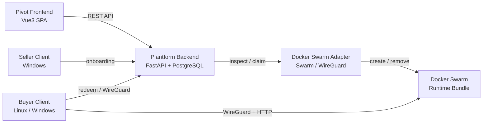

# Pivot Network

算力交易平台 —— 卖家提供 GPU 算力，买家像使用云主机一样消费它。

```text
Seller → Verified Node → Offer → Order → AccessGrant → RuntimeSession → WireGuard → Shell / Workspace / Task
```

## 仓库结构

```
.
├── Pivot_Network_Frontend/   # Vue3 前端（6 页面对买家/卖家/监控的完整覆盖）
├── Pivot_Network_Backend/    # FastAPI + PostgreSQL + Docker Swarm + WireGuard 后端
├── README.md                 # 本文件
└── .gitignore
```

### 前端 `Pivot_Network_Frontend/`

| 页面 | 说明 |
|---|---|
| 平台总览 | 指标卡片、活动流、集群状态摘要 |
| 资源市场 | GPU 资源浏览、规格筛选、下单抽屉 |
| 算法工坊 | 算法模板卡片展示与选用 |
| 监控中心 | GPU 趋势图、节点状态列表 |
| 卖家控制台 | 资源发布表单（含校验）、上架管理 |
| 会话中心 | 运行时任务卡片、会话操作 |

- **技术栈**: Vue 3 + Vite + Pinia + Vue Router + TypeScript
- **组件体系**: 6 个通用 UI 组件 + 6 个业务卡片组件 + 4 个功能组件
- **状态管理**: offers / session / monitor 三个领域 Store
- **API 层**: mock/real 可切换（`services/api/client.ts` 中 `useMock` 开关）

### 后端 `Pivot_Network_Backend/`

- **Plantform_Backend/**: FastAPI + PostgreSQL 业务真相面
- **Docker_Swarm/**: Swarm / WireGuard / runtime adapter
- **Seller_Client/**: 卖家本地客户端（Windows）
- **Buyer_Client/**: 买家本地客户端（Linux / Windows）
- **wireguard/**: WireGuard 配置与密钥管理
- **docs/**: 教程、架构说明、runbooks

## 快速开始

### 前端

要求: Node.js >= 18

```bash
cd Pivot_Network_Frontend
npm install
npm run dev        # 开发模式 → http://127.0.0.1:5173
npm run build      # 生产构建
```

### 后端

要求: Linux、Docker + Docker Compose

```bash
cd Pivot_Network_Backend/Plantform_Backend
cp .env.example .env
docker compose up -d --build
```

启动后:
- PostgreSQL 16: `localhost:55432`
- FastAPI: `localhost:8000`

完整链路还需要配置 Docker Swarm + Adapter + WireGuard，详见 `Pivot_Network_Backend/README.md`。

## 架构概览



## 文档索引

- [前端 README](Pivot_Network_Frontend/README.md)
- [前端设计文档](Pivot_Network_Frontend/文档/Pivot前端成品设计方案-Vue3版.md)
- [后端 README](Pivot_Network_Backend/README.md)
- [后端 PROJECT](Pivot_Network_Backend/PROJECT.md)
- [项目名词说明](Pivot_Network_Backend/项目名词说明.md)
- [架构说明](Pivot_Network_Backend/架构说明.md)
- [MVP 技术方案](Pivot_Network_Backend/个人算力交易平台MVP技术方案.md)
